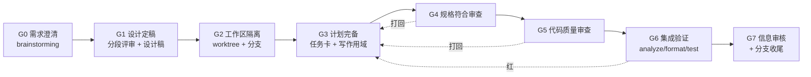
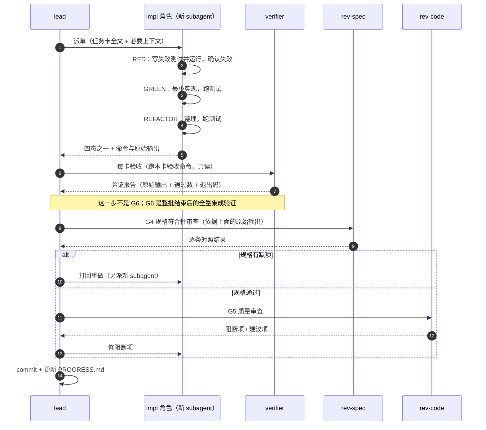
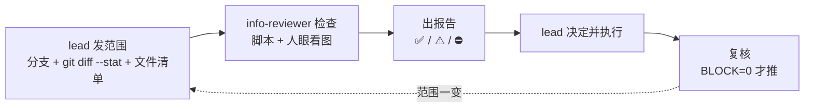
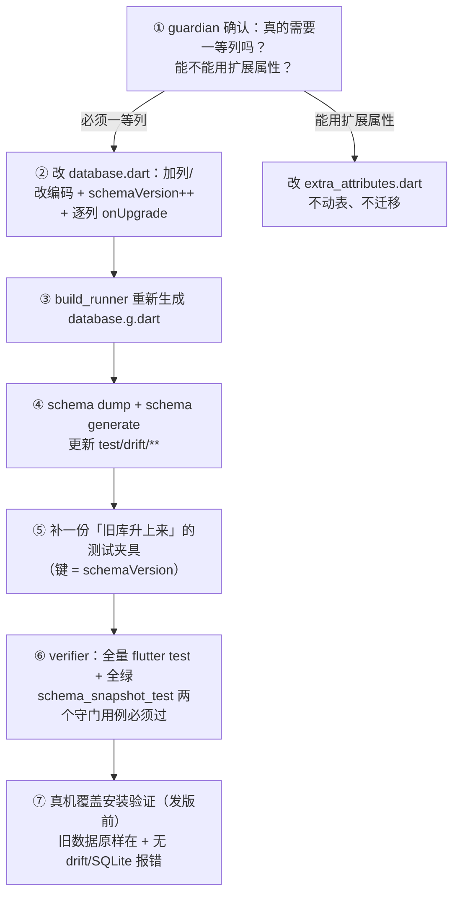
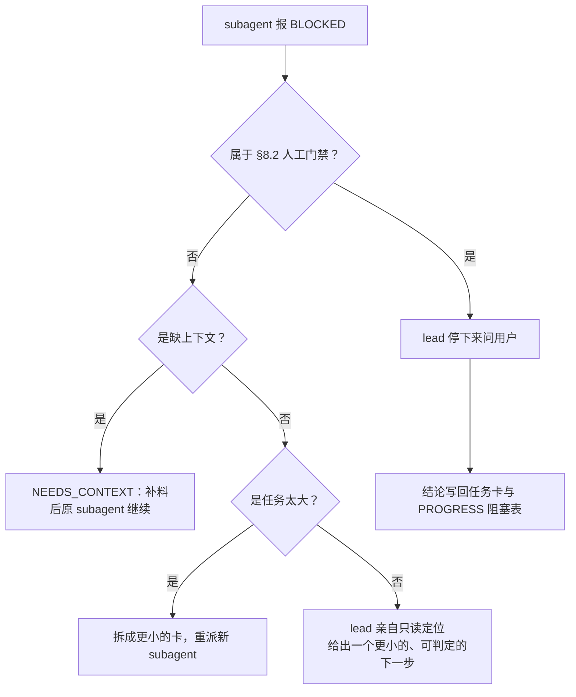

# 豆刻 BeanClick · Agent Teams 开发手册

> 状态：**v1 定稿**（2026-10-01）
> 读者：带队的 **Lead**（人）与他派出的 **subagent**（代理）
> 定位：把「Superpowers 七阶段 + 子代理驱动开发」这套工程纪律，
> 落到豆刻（Flutter + Drift + Riverpod）这一台具体项目上。
>
> **本手册只写豆刻特有的部分。** 通用规范不重复，一律指向现有文档：
> 开发环境见 [`docs/DEVELOPMENT.md`](../DEVELOPMENT.md)、
> 产品和数据模型见 [`docs/BeanClick-开发手册-v0.2.md`](../BeanClick-开发手册-v0.2.md)、
> 加字段见 [`docs/添加新属性指南.md`](../添加新属性指南.md)、
> 推送前审核见 [`docs/REVIEW-BEFORE-PUSH.md`](../REVIEW-BEFORE-PUSH.md)。

---

## 目录

| 节 | 标题 | 什么时候读 |
|---|---|---|
| [1](#1-一页速查) | 一页速查 | 每次开工前 |
| [2](#2-为什么豆刻需要它) | 为什么豆刻需要它 | 第一次读 |
| [3](#3-团队编制) | 团队编制 | Lead 组队时 |
| [4](#4-写作用域豆刻的冲突地图) | 写作用域：冲突地图 | 拆任务卡时**必读** |
| [5](#5-七阶段与八道门禁g0g7) | 七阶段与八道门禁（G0–G7） | 全程 |
| [6](#6-任务卡规范) | 任务卡规范 | 写计划时 |
| [7](#7-迁移门mg豆刻最贵的一次操作) | 迁移门 MG | 碰 schema 时 |
| [8](#8-子代理返回协议与升级路径) | 子代理返回协议 | 派单/收单时 |
| [9](#9-进度暴露协议对人) | 进度暴露协议（对人） | 每次状态变化 |
| [10](#10-反模式清单) | 反模式清单 | 出事时查 |
| [11](#11-lead-开工清单) | Lead 开工清单 | 每次迭代 |

配套文件：

| 文件 | 作用 |
|---|---|
| [`README.md`](README.md) | 这套文档怎么用、谁读哪份 |
| [`PROGRESS.md`](PROGRESS.md) | **进度看板（唯一真相源）**，mermaid |
| [`Mermaid-图集.md`](Mermaid-图集.md) | 全部图的母版，复制即用 |
| [`任务卡模板.md`](任务卡模板.md) | 任务卡格式 + 3 张填好的样例 |
| [`审查报告模板.md`](审查报告模板.md) | 规格 / 质量 / 信息审核三份报告模板 |
| [`skills/`](skills/) | 8 张技能卡，**直接喂给 subagent** |

---

## 1. 一页速查



| 项 | 豆刻取值 |
|---|---|
| 阶段数 | 7（照 Superpowers），出口是**门禁**不是"做完了" |
| 门禁数 | 8 个（G0–G7），另有 3 道**特区门**：DG 设计稿 / MG 迁移 / PG 推送 |
| 实现单元 | 一张任务卡 = 一个新 subagent = 一次 commit |
| 卡片粒度 | S 2–5 分钟、M 10–30 分钟、L **必须拆**（见 §6.1） |
| 写作用域 | **文件级**，一张卡不许跨 `lib/data` 与 `lib/features`（见 §4） |
| 审查 | 两阶段，**实现者不得自审**，规格没过不得起质量审 |
| 真相源 | [`PROGRESS.md`](PROGRESS.md)，只有 Lead 能写 |
| 唯一不可让步 | 用户数据只有一份 → 迁移必须逐列；公开仓库 → 推送必须先审核 |

---

## 2. 为什么豆刻需要它

不是"AI 写代码要纪律"这种空话。下面五条是**这个仓库里已经存在的、会导致真实损失的结构性事实**。

| # | 事实（有据可查） | 不用 Agent Teams 会怎样 | 本手册的对应约束 |
|---|---|---|---|
| 1 | **单个文件就超出一个会话的舒适区**：`lib/features/record/brew_log_form_page.dart` 74 KB、`lib/domain/entities.dart` 43 KB、`lib/data/database.dart` 31 KB、`database.g.dart` 383 KB（生成物） | 一个会话从头做到尾，读到后面判断力下降，改错已读过的部分 | §6.1 任务卡按**文件**切；一个 subagent 只拿一张卡 + 必要上下文 |
| 2 | **加一个一等列要改 6 个地方**（表定义 / schemaVersion + 迁移 / 实体 / 双向映射 / 表单与展示 / 测试），漏一处要等 CI 才发现 —— 见 [`添加新属性指南.md`](../添加新属性指南.md) §2 | 实现者漏了 `mappers.dart`，`flutter analyze` 照样过，运行时才炸 | §6.2 任务卡带**完成定义（DoD）清单**；§5.6 集成验证按清单点名 |
| 3 | **用户数据只有一份**：`onUpgrade` 必须逐列迁移，快照要 dump、夹具要补，`schema_snapshot_test.dart` 会点名缺失（[`DEVELOPMENT.md`](../DEVELOPMENT.md) §7.4） | 删表重建 / 忘跑 `schema dump`；老用户升级后丢数据，**不可逆** | §7 迁移门 MG：由专职 `guardian` 独占，全局串行 |
| 4 | **UI 改动必须先出设计稿**（用户明确要求，[`DEVELOPMENT.md`](../DEVELOPMENT.md) §13.1）：五项内容 + 先线框图后渲染 PNG | 代理自作主张改布局，做完才发现理解错了「收藏」「右滑」指的是什么 | §5.3 设计稿门 DG：**人的签字**是门禁，代理不得绕过 |
| 5 | **仓库是公开的**，推送前必须过信息审核（[§13.3](../DEVELOPMENT.md) / [`REVIEW-BEFORE-PUSH.md`](../REVIEW-BEFORE-PUSH.md)），本项目已有专职「审核员」角色 | 一条 `<盘符>:\...` 路径或一张设备截图推上去，永久公开 | §5.7 推送门 PG：`info-reviewer` 只读出报告，Lead 才动 git |

> 一句话：**豆刻的失败模式不是"写得慢"，而是"改错了一处数据、漏了一层映射、推上去一版收不回来"。** 本手册的每一道门都对着其中一条。

---

## 3. 团队编制

### 3.1 三类席位

| 类型 | 席位 | 谁必须有 | 写权限 |
|---|---|---|---|
| **协调** | `lead` | ✅ 任何规模 | 任务卡、`PROGRESS.md`、git 操作、唯一合并者 |
| **实现** | `impl-data` / `impl-ui` / `impl-test` | 按任务类型按需 | 只在任务卡声明的 scope 内 |
| **审查与守门** | `guardian` / `rev-spec` / `rev-code` / `verifier` / `info-reviewer` | `verifier` + `guardian` 必配 | **只读**（只写各自的报告文件） |

### 3.2 角色表

| 代号 | 职责 | 写作用域（默认） | 明确禁区 | 技能卡 |
|---|---|---|---|---|
| `lead` | 拆卡、派单、收单、落盘进度、唯一执行 git | `docs/agent-teams/**`、任务板 | 不亲自改产品代码（改了就没人能审） | [lead-orchestration](skills/beanclick-lead-orchestration/SKILL.md) |
| `guardian` | schema / 迁移 / 生成物 / 快照守门 | `lib/data/database.dart`、`lib/data/database.g.dart`、`test/drift/**`、**该卡的旧库升级夹具文件**（通常是 `test/data/schema_snapshot_test.dart`） | 不改 UI 层 | [drift-migration-guard](skills/beanclick-drift-migration-guard/SKILL.md) |
| `verifier` | 独立跑命令，交**原始输出** | 只写验证报告 | 不改任何产品代码或测试 | [verify-before-done](skills/beanclick-verify-before-done/SKILL.md) |
| `info-reviewer` | 推送前信息审核（沿项目既有制度） | 只写审核报告 | **不碰 git**，不改产品代码 | [pre-push-info-review](skills/beanclick-pre-push-info-review/SKILL.md) |
| `impl-data` | Drift / 实体 / 映射 / 仓储 | `lib/data/**`、`lib/domain/**` | 不改 `lib/features/**` | [subagent-task-loop](skills/beanclick-subagent-task-loop/SKILL.md) |
| `impl-ui` | 页面 / 组件（**须先过 DG 门**） | 指定的 `lib/features/<页面>.dart` | 不改 `lib/data/**` | [ui-design-gate](skills/beanclick-ui-design-gate/SKILL.md) |
| `impl-test` | 补测试与夹具（不写产品代码） | 指定的 `test/**` | 不改 `lib/**` | [subagent-task-loop](skills/beanclick-subagent-task-loop/SKILL.md) |
| `rev-spec` | 规格符合性审查 | 只写报告 | 不实现、不代改 | [two-stage-review](skills/beanclick-two-stage-review/SKILL.md) |
| `rev-code` | 代码质量审查 | 只写报告 | 同上 | [two-stage-review](skills/beanclick-two-stage-review/SKILL.md) |

> `impl-ui` 与 `impl-data` 的禁区不是形式主义：跨层改动是豆刻最容易漏映射的地方（事实 2），
> 跨层**必须拆成两张有依赖关系的卡**，中间夹一次 `verifier` 的 `flutter analyze`。

### 3.3 两条铁律（抄 Superpowers，但理由是本项目的）

1. **实现者不得审查自己。** 同一个 subagent 既写又审，等于没审 —— 它只会确认自己"写对了"。
2. **规格符合性没过，不得启动质量审查。** 顺序颠倒会出现"代码很漂亮但少了一个字段"的结果，
   而质量审查根本发现不了（它不看需求）。豆刻的典型事故就是漏 `mappers.dart` 或漏夹具。

### 3.4 最小可跑编制

| 规模 | 编制 | 适用 |
|---|---|---|
| **3 人**（推荐起步） | `lead` + `guardian` + `verifier`，实现任务临时派 subagent 兼任 | 单批 UI / 单次加列 |
| **5 人** | 上面 + `impl-data` + `impl-ui` | 一个完整功能（如 M5 计时器） |
| **7 人** | 上面 + `rev-spec` + `info-reviewer` | 要出包 / 要发版 / 要推公开仓库 |

**不要为了并行而并行。** 豆刻的热点文件（§4.2）只有 5 个，写者一多，
在热点文件上排队的时间会超过并行省下的时间。

---

## 4. 写作用域：豆刻的冲突地图

> 这一节是**拆任务卡的输入**。拆卡之前先看这张表，比事后再去解冲突便宜一个数量级。

### 4.1 目录所有权矩阵

| 路径 | 默认所有者 | 可并发的写者数 | 备注 |
|---|---|---|---|
| `lib/data/database.dart` | `guardian` | **1** | 转换器 + 表定义 + `AppDatabase` 必须在同一文件（[§7.2](../DEVELOPMENT.md)） |
| `lib/data/database.g.dart` | `guardian`（由 `build_runner` 生成） | **1** | **禁止手改**；只有 guardian 能触发 `build_runner` |
| `lib/data/mappers.dart` | `impl-data` | 1 | 与实体成对改，通常同一张卡 |
| `lib/data/repositories/*.dart` | `impl-data` | 按文件可并发 | 四个仓储之间无共享写 |
| `lib/domain/entities.dart` | `impl-data` | 1 | 热点，见 §4.2 |
| `lib/domain/enums.dart` | `impl-data` | 1 | 加枚举值本身不需要迁移（[指南 §5](../添加新属性指南.md)） |
| `lib/domain/extra_attributes.dart` | `impl-data` | 1 | 加扩展属性只动这一处 |
| `lib/features/<页面>.dart` | `impl-ui` | **按页面 1** | 不同页面可并发 |
| `lib/core/widgets/*.dart` | `impl-ui` | 1 | 被多页引用，改一处影响面大，需 `verifier` 全量回归 |
| `test/**` | 与**同一张卡**的实现者配对 | 按文件 | TDD：先写失败测试再写实现，所以测试与实现同卡。**例外**：旧库升级夹具（`_fixtures`）跟着迁移走，归 `guardian`，Lead 派迁移卡时必须把它写进 scope |
| `test/drift/schemas/**`、`test/drift/generated/**` | `guardian`（由命令生成） | **1** | 快照是冻结资产，只能由 drift_dev 生成 |
| `tool/**` | 提出者 | 按文件 | `.ps1` 必须 ASCII 无 BOM 且**不含中文注释**（[`tool/README.md`](../../tool/README.md)） |
| `docs/**` | `lead` + 各任务作者 | 按文件 | 设计稿 / 评审各一篇，不互相改 |
| `docs/agent-teams/PROGRESS.md` | **`lead` 独占** | **1** | 唯一真相源，见 §9 |

### 4.2 五个热点文件（同一时刻只能有一个写者）

| 热点 | 为什么危险 | 串行化手段 |
|---|---|---|
| `lib/data/database.dart` | 表定义 + 迁移 + 转换器全在一起；两处并发改会产生互相覆盖的迁移段 | 迁移类卡一律**依赖前一卡完成**，`guardian` 独占 |
| `lib/domain/entities.dart` | 43 KB，每次加字段都要动 `copyWith` / `toJson` / `fromJson` / `==` / `hashCode` 五处 | 同一批次的多列变更**合并成一张卡**，或显式依赖 |
| `lib/features/record/brew_log_form_page.dart` | 74 KB，记录表单是全部核心字段的汇聚点 | 一次只派一张卡；改之前先让 subagent 只读定位行号 |
| `lib/core/widgets/form_fields.dart` | 21 KB，被多个表单页引用 | 改完必须跑全量 `flutter test`，不能只跑相关文件 |
| `test/widget_test.dart` | 21 KB 外壳冒烟，任何 dock / 导航改动都会碰它 | 与 UI 卡同卡（它就是那张卡的回归网） |

### 4.3 全局串行资源（不是文件，但同样只能一人动）

| 资源 | 为什么串行 | 规矩 |
|---|---|---|
| `dart run build_runner build` | 会重写整个 `database.g.dart`，两个进程同时跑必然坏 | 只有 `guardian` 触发；跑之前 `git status` 必须干净 |
| `dart format .`（全量） | 会顺手改别人的文件，污染 diff | **只格式化自己卡里的文件**；全量格式化由 Lead 在集成阶段单独做一次 |
| `dart run drift_dev schema dump / generate` | 重写 `test/drift/**` | `guardian` 独占；dump 后**必须**补一份测试夹具（[§7.4](../DEVELOPMENT.md)） |
| `flutter test` | 会加载工程根目录的 `sqlite3.dll`（gitignore 的）。**并发不是"变慢"而是直接报错** | 一张卡一次；集成阶段由 `verifier` 统一跑一次全量 |
| `git add/commit/push` | 唯一历史 | **只有 `lead`**；subagent 一律不碰 git |
| APK 构建 / 真机安装 | 依赖本机 Gradle 守护进程与设备 | `verifier` 独占；构建异常慢先查残留 `java` 进程 |

> ⚠️ **`flutter test` 并发的真实症状（2026-10-01 实测，两条独立卡各撞一次）**：
> 第二个进程会以
> `Flutter failed to delete file at build\native_assets\windows\sqlite3.dll`
> 之类的形式失败 —— 看起来像"构建坏了"，其实是**别人正在跑同一个 worktree 的测试**。
> 遇到它先看同 worktree 有没有并行的卡，**不要**去删 `build/` 或重装依赖。
> 这也意味着：**并行卡即使用户级文件不相交，也不能同时跑 `flutter test`**；
> 各自的 RED/GREEN 循环要错开（或由 `lead` 明确排队）。

### 4.4 拆卡的三条判据

1. **scope 相交 → 必须串行**：两张卡的文件集合有交集，就加 `blocked_by`，不要指望"我们只改不同函数"。
2. **不能跨层**：`lib/data` 与 `lib/features` 不出现在同一张卡的 scope 里。
3. **一张卡 ≤ 3 个文件**（生成的 `*.g.dart`、快照 JSON 不计）：超过就说明这卡是 L，回去拆。

---

## 5. 七阶段与八道门禁（G0–G7）

> 「七阶段」是 Superpowers 的流程骨架（头脑风暴 → 设计确认 → 工作区隔离 → 编写计划 →
> 子代理开发 → 代码审查 → 分支收尾）；「八道门禁」是本项目给这条流程装的**可判定出口**，
> 编号 G0–G7。两者不是一回事：阶段是"走到哪"，门禁是"凭什么放行"。

### 5.1 门禁总表

| 门 | 名称 | 出口条件（**可判定**） | 谁判定 |
|---|---|---|---|
| **G0** | 需求澄清 | 提问清单全部有回答；`docs/agent-teams/plans/Mx-*.md` 里没有 `TBD` | Lead + 用户 |
| **G1** | 设计定稿 | 设计稿五项齐全（[§13.1](../DEVELOPMENT.md)）；**UI 改动另过 DG** | 用户签字 |
| **G2** | 工作区就绪 | worktree 建好、分支名合规、基线 `flutter test` 全绿且记下测试数（**`verifier` 执行并落盘，`lead` 记录**） | `verifier` |
| **G3** | 计划完备 | 每张卡都有：文件级 scope、依赖、验收命令、DoD 清单；scope 无交叠 | Lead |
| **G4** | 规格符合 | `rev-spec` 逐条对需求点，**无缺项** | `rev-spec` |
| **G5** | 代码质量 | `rev-code` 无阻断项；`flutter analyze` 0 问题；本卡测试绿（**依据 `verifier` 交的原始输出，`rev-code` 不重复跑全量测试**） | `rev-code` |
| **G6** | 集成验证 | `dart format --output=none --set-exit-if-changed .`、`flutter analyze`、`flutter test` **全绿**，测试数 ≥ 基线 | `verifier` |
| **G7** | 信息审核 + 收尾 | `check_upload_safety.ps1 -All` 退出码 0；图片人工项有结论；用户选了下游动作 | `info-reviewer` + 用户 |

**三道特区门**（可能在任何阶段触发）：

| 特区门 | 触发条件 | 额外要求 |
|---|---|---|
| **DG 设计稿门** | 任何 UI 改动（[§13.1 的判定表](../DEVELOPMENT.md)） | 线框图 → 用户确认结构 → `tool/design_preview/` 渲染 PNG → 用户点头。**没签字不得写 UI 代码** |
| **MG 迁移门** | `schemaVersion` 要变 / 表结构要变 / 枚举存储编码要变 | 见 §7：七步一步不能少，`guardian` 独占 |
| **PG 推送门** | 任何 `git push` / 建 PR / 发 Release | 见 §5.7，范围一变就重审 |

### 5.2 G0 需求澄清

照 Superpowers 的苏格拉底式提问，但**问题必须从仓库里长出来**，不是通用模板。

豆刻的固定提问集（每次至少过一遍，不适用的写"不适用"）：

1. 这次改动**碰不碰 schema**？（碰 → MG 门，考虑值不值得）
2. 这个新字段**会不会出现在 `WHERE` / `ORDER BY` / 聚合里**？
   （会 → 一等列；不会 → 扩展属性，[指南 §0](../添加新属性指南.md)）
3. 有没有 **UI 改动**？（有 → DG 门，先出稿）
4. 影响余量扣减 / 导出格式 / 统计计算吗？（影响 → 必须有单元测试，[CONTRIBUTING](../../CONTRIBUTING.md)）
5. 会不会让**现有测试断言失效**？（会 → 按"先发稿"处理）
6. 属于哪个里程碑（M3/M5/M6）？不进里程碑的改动要不要现在做？
7. 有没有**已有实现**可以复用（扩展属性 / 枚举 `selectable` / 通用组件）？

产出：`docs/agent-teams/plans/M<milestone>-<slug>.md` 的 §1「澄清记录」。

### 5.3 G1 设计定稿（分段评审 + DG）

**分段**，不是一次给一份 50 页文档：数据层一段、UI 一段、验收一段，每段 3–5 分钟能看完。

* **数据层改动** → 产出形如 [`M2.5-数据层设计评审.md`](../M2.5-数据层设计评审.md) 的评审文档：
  现状结构 → 设计决策与理由 → 问题清单与处理结果 → 测试覆盖。
* **UI 改动** → 产出形如 [`M2.10-研磨刻度设计稿.md`](../M2.10-研磨刻度设计稿.md) 的设计稿，
  必含五项：目标、布局示意、尺寸与状态、与现状的差异（含受影响的测试）、2–3 个待确认项。
  呈现两步走：**线框图 → 结构定稿 → `tool/design_preview/` 渲染 PNG → 观感定稿**。
  渲染脚手架放 `tool/design_preview/`，**不要放进 `test/`**（跨平台字体差异会造成假红）。
* v5 的「规格对抗审查」在豆刻的等价物：`rev-spec` **提前**读设计稿，专找 `TBD`、
  "大概""可能""以后再补"这类模糊表述，列成待确认项交回用户。**在 G1 就把歧义挖干净**，
  比在 G4 才发现便宜得多。

### 5.4 G2 工作区隔离

```powershell
# 分支命名遵循 CONTRIBUTING：feat/ fix/ docs/ refactor/
git worktree add <工程根目录的父目录>\<仓库名>-<slug> -b feat/<slug>
# 在新 worktree 里：
flutter pub get
dart run build_runner build --delete-conflicting-outputs
flutter test        # 记下通过数，这就是本次的回归基线
```

* 主分支始终干净；方案不可行就删 worktree，零副作用。
* **基线必须先测**。不知道基线是多少，"测试全过"这句话就没有信息量（见 §10 反模式）。
  由 `verifier` 执行并把命令与数字落盘，`lead` 记录进 `PROGRESS.md`。
* 一次性 / 只读的探索**不必**建 worktree；只要会写文件就该隔离。

**同一批里有并行卡时，worktree 是"批"的、不是"卡"的**（2026-10-01 实测补）：

* 本项目的默认做法是**一批一个 worktree**（省 G2 成本），靠 §4.4 判据 1 保证并行卡的文件**不相交**。
* 代价：**`git status` 不再能证明"我只改了自己 scope 内的文件"** —— 并行期间它会同时列出别人的 WIP，
  甚至别人的 RED 测试（本批实测：T14 收工时全量 `flutter test` 是 `+303 -4`，那 4 条红是**同 worktree 里
  T12 尚未实现的 RED 测试**，不是 T14 的回归）。
* 所以**每卡验收一律用 scoped diff**，不要用 `git status`：

  ```powershell
  git diff --stat -- <本卡 scope 的文件>      # 这才是"有没有越界"的证据
  ```

* 收工汇报里**必须写明"哪些改动不是我的"**，否则 `lead` 会把别人的红算到这张卡头上。
* 卡里那条"DoD：`git status` 只应看到你 scope 内的文件"**只适用于串行批次**；并行批次里
  它是不可能满足的，写卡时别照抄（本批第一版卡就是这么写错的，被 T14 当场指出）。

**卡里必须写全"会被这次交互改动推翻的测试文件"**（2026-10-01 实测补）：

* 本项目用**临时 subagent** 做实现，而**subagent 一旦开工就无法中途 steer**
  （`send_message` 只对常驻 teammate 生效；本批实测对 subagent 直接报 `not found`）。
  也就是说：**派单时漏掉的文件，只能等这张卡收工后再派一张后续卡**，白多一轮串行。
* 本批真实代价：M3-T15 把"填占比 + 总粉量可编辑"改成"每支填克数"，而
  `test/features/blend_form_test.dart` 有 5 条用例**直接建立在这个被推翻的交互上**
  （写卡时我只列了 `grind_turns_test.dart` / `batch1_ui_test.dart`，漏了它）→
  只能另立 `M3-T19` 补，且那一刻分支是全红的。
* **规矩**：写卡时先 `grep` 一遍**要改的 Key / 字段 / 交互名**在 `test/` 下的全部引用，
  把命中的测试文件一起写进 scope（§4.1 本来就规定"测试与实现同卡"，漏的通常是**别的**测试文件）。
  例：改"填占比"这种交互，`grep 'brew.share\|brew.dose' test/` 就能一次找准。

**并行批次下"一张卡 = 一次 commit"要打折扣**（2026-10-01 实测补）：

* 手册 §3.3 / §6.1 的"一卡一 commit"隐含前提是**一张卡独占一个工作区**。本项目为了省 G2 成本
  改成"**一批一个 worktree**"，于是同一批次里多张卡会**改同一个文件**（本批 `brew_log_form_page.dart`
  被 T12 / T15 / T18 三张卡先后改过，且**全程没有 commit**）。
* 结果：收工时那些改动在文件里**已经交织**，按卡拆 commit 需要逐 hunk 手术（易错、且会把
  "谁改的"变成考古）。**结论**：
  * 一批一个 commit 是**可接受的**，但 commit message **必须逐卡列出**：卡号、目标、关键改动、
    验收证据（命令 + 通过数 + 退出码）、以及"哪张卡由谁审的"。
  * 或者（更稳）：**同一热点的卡串行 + 每张卡收工即 commit**，代价是多几次 `flutter test`。
  * 无论哪种，`PROGRESS.md` 的 §3 任务表都必须逐卡写清 commit 归属 —— 那是唯一的对账依据。
* 反过来说：**能并行的是"文件不相交"的卡，但 `flutter test` 仍要排队**（见 §4.3），
  所以并行的真正收益是"实现/思考"的并行，不是"跑测试"的并行。

### 5.5 G3 计划完备（任务卡）

拆成任务卡，每张卡满足 §4.4 的三条判据 + §6.2 的九个字段。
计划本身写成 `docs/agent-teams/plans/M<milestone>-<slug>.md`，任务清单同步进
[`PROGRESS.md`](PROGRESS.md) 的 DAG 图。

**这一步的产出是可以直接派单的**：把任务卡原文粘进 `spawn` 的 prompt 就能开工。

### 5.6 G4–G5 子代理开发与两阶段审查

一个任务卡的完整闭环（**注意这里有两道验证**：`verifier` 的**每卡验收**、以及整批结束时的 **G6 集成验证**；
G4 / G5 判定所依据的原始输出来自前者，不重复跑全量）：



硬性顺序（违反任意一条，这次开发作废重来）：

1. **RED 必须先失败**。没跑过失败的测试就写实现，等于不知道测试测的是什么。
2. **实现者不自审。**
3. **G4 未过不起 G5。**
4. **有未修复的阻断项不得开下一张卡。**
5. **每个任务一个新 subagent**，不把上一张卡的对话带过来（上下文污染，见 §2 事实 1）。
6. **打回重做也另派新 subagent**；只有 `NEEDS_CONTEXT`（缺料）才让**原 subagent 继续**（§8.1）。

### 5.7 G6 集成验证 与 G7 收尾

**G6（`verifier` 独立执行，贴原始输出）**：

```powershell
dart format --output=none --set-exit-if-changed .   # CI 同款
flutter analyze                                     # 期望 No issues found!
flutter test                                        # 期望全绿，且数量 ≥ 基线
# 若碰过 schema：
dart run drift_dev schema dump lib/data/database.dart test/drift/schemas
dart run drift_dev schema generate test/drift/schemas test/drift/generated
git status --short        # 期望干净：说明快照没漏、生成物无 diff
```

**G7（四步，缺一步不算完成）**：



```powershell
powershell -NoProfile -ExecutionPolicy Bypass -File .\tool\check_upload_safety.ps1 -All
# 退出码 0 = 无阻断项；1 = 有阻断项，停；2 = 脚本自身跑不起来
```

> **一条已知的有意口径**：`docs/DEVELOPMENT.md` 与 `RELEASING.md` 里写明的
> 便携工具链绝对路径属"有意记录的项目约定"，按 [`REVIEW-BEFORE-PUSH.md`](../REVIEW-BEFORE-PUSH.md) §3C
> 判为**提示 INFO**，不是残留。而 `docs/agent-teams/**` 这套文档一律用占位符
> （`<工程根目录>` / `<便携工具链根目录>` / `<盘符>`）。两套口径并存是有意的，
> 审核时不要把它们混为一类。

收尾选项（问用户，不自己拍板）：建 PR / 本地合并 / 保留分支 / 丢弃 worktree。
版本或里程碑有变化时，同步 `README.md` 状态行、`docs/CHANGELOG.md`、`RELEASING.md`。

---

## 6. 任务卡规范

### 6.1 粒度分级

Superpowers 说"2–5 分钟"，那是对"改一个函数"说的。豆刻的现实是**一次加列 = 20–40 分钟**。
所以按风险分级，不按时间硬切：

| 级别 | 典型任务 | 预计 | 处理 |
|---|---|---|---|
| **S** | 加一个扩展属性定义；把预留枚举移进 `selectable`；改文案；补一条测试 | 2–5 分钟 | 直接派；**可并行，但并行前仍须过 §4.4 判据 1**（例：两张都改 `lib/domain/extra_attributes.dart` 的 S 卡照样要串行） |
| **M** | 加一个一等列（6 处改动 + 迁移）；新增一个表单字段；新增一页骨架并接入 dock | 10–30 分钟 | 一张卡一个 subagent，必须带 DoD 清单 |
| **L** | 统计三件套（评分趋势 / 参数对比 / 消耗）；WebDAV 同步；JSON 导入 | 半天以上 | **必须先拆成 ≥3 张 S/M 卡**，拆完再派 |

**L 不许直接派单。** 派一张 L 卡给一个 subagent，等于让它在一个会话里做完整个功能 ——
这正是 §2 事实 1 要避免的事。

### 6.2 一张卡的九个必填字段

| # | 字段 | 要求 |
|---|---|---|
| 1 | **ID** | `M<milestone>-T<nn>`，例 `M3-T04` |
| 2 | **目标** | 一句话，可判定。不写"优化一下" |
| 3 | **写作用域** | **文件级**清单；与所有者矩阵（§4.1）一致；不跨层 |
| 4 | **输入** | 需要读的文件、设计稿、既有实现；**只给这一张卡需要的** |
| 5 | **步骤** | 顺序化，含 TDD 的 RED/GREEN/REFACTOR 三段 |
| 6 | **DoD 清单** | 逐条勾选，覆盖"6 个地方"这类容易漏的点 |
| 7 | **验收命令** | 可直接粘贴执行，含**期望输出** |
| 8 | **禁止事项** | 本卡的红线（不许碰 git / 不许改生成物 / 不许跑全量 format …） |
| 9 | **依赖** | `blocked_by` / `blocks`；无依赖写"无" |

完整格式与三张填好的样例见 [`任务卡模板.md`](任务卡模板.md)。

### 6.3 依赖与阻塞

* **依赖只表达"顺序"，不表达"能开工"**。子代理不会因为依赖解除而自动醒来 ——
  依赖完成之后必须由 `lead` 显式派单。这是最容易搞错的一点。
* 依赖图别超过 3 层。超过就说明这张"卡"其实是几个功能混在一起，回去拆。
* `blocked` 的卡必须在 [`PROGRESS.md`](PROGRESS.md) 的阻塞表里出现，并写清**解除条件**。

---

## 7. 迁移门（MG）：豆刻最贵的一次操作

> 迁移一旦出错，老用户的数据不可逆地损坏。**这是本项目唯一一个"宁可慢也不能错"的环节。**

### 7.1 触发条件

满足任意一条即触发：`schemaVersion` 要递增 / 表结构（列、索引、外键、NOT NULL）要变 /
枚举的**存储编码**要变（例：v7 把 `process` 从单个名字改成 JSON 数组）。

### 7.2 七步，一步不能少



### 7.3 三条硬规矩（照抄 [`DEVELOPMENT.md`](../DEVELOPMENT.md) §7.4）

1. **`onUpgrade` 必须逐列迁移**，不许删表重建。
2. **搬迁顺序不能变**：先建新表 → 搬数据 → 最后才删旧列。
3. **改表必须配一个「旧库升上来」的测试**；只比列名不够，`NOT NULL` / `DEFAULT` / 漏建索引都要能测出来。

补充两条工程规矩：

4. **用 `addColumn` / `dropColumn`，不用 `alterTable` 重建表**：`coffee_beans` 被
   `bean_batches` / `brew_log_beans` / `brew_logs` 外键引用，删父表会级联删掉刚搬好的数据。
5. **未知枚举值必须优雅降级**：不要用 `textEnum<T>()`（内部 `values.byName` 遇到未知字符串会抛
   `ArgumentError`，旧版本读到新值会直接崩），要用裸 `text()` + 自定义容错转换器
   （[指南 §5.1](../添加新属性指南.md)）。

6. **「改类型 / 改主键」是另一类操作，本项目至今没有走过。**
   [指南 §2.2](../添加新属性指南.md) 说这类改动"必须走建新表 → 搬数据 → 删旧表"，
   而 §7.3 第 4 条说"不要 `alterTable` 重建表"——**两句都对，针对的是不同的改动**：

   | 改动类型 | 做法 |
   |---|---|
   | 加列、删列、**改列的值**（枚举存储编码） | `addColumn` / `dropColumn` + 改写值。v4 → v5 → v6 → v7 全部是这一类 |
   | 改列类型、改主键、改 `NOT NULL` / `DEFAULT` | 只能重建表（被引用方还必须先处理外键） |

   **重建被外键引用的父表（如 `coffee_beans`）时，删父表会触发级联删除。**
   Drift 迁移跑在事务里，`PRAGMA foreign_keys=OFF` 在事务内不生效——
   这条路径本项目**没有验证过**。所以规矩是：
   **MG 门里遇到"必须重建被引用的表"，先停下报 `BLOCKED` 并问人**，
   不要在生产迁移里做第一次尝试。真要做，先在 `test/` 里造一个最小复现证明级联行为可控。

### 7.4 guardian 必须交的证据

| 证据 | 形式 |
|---|---|
| 新旧结构一致 | `schema_snapshot_test.dart` 通过，且失败信息里不含 `unexpected entries` |
| 每个历史版本都能升级 | 每个 dump 过的版本各有一份夹具；`GeneratedHelper.versions` 全部覆盖。**例外**：v1 既无快照也无夹具，它的升级路径由 `test/data/migration_v1_to_v4_test.dart` 单独整跑一遍（不是漏了） |
| 数据一条不少 | 夹具断言：豆子 / 批次 / 拼配用量行 / 扩展属性 / 改过的设置项全部保留 |
| 迁移后功能照常 | 同一批测试里断言**迁移后余量扣减仍工作** |
| 生成物无脏 diff | `git status --short` 干净 |

> 「两个守门用例」是 [`DEVELOPMENT.md`](../DEVELOPMENT.md) §7.4 的说法，指的是**两类事故**：
> ①当前结构与最新快照的逐列比对（挡"改了表忘 dump"）；
> ②对每个 dump 过的版本各跑一遍的夹具循环（挡"改了表没写迁移 / 迁移搬丢数据"）。
> 第 ② 类实际是"每个版本一条"，dump 一个新版本就自动多一条。

> 造旧库**不要手抄旧建表语句**：用 `git worktree` 检出旧提交，从 `sqlite_master` dump。

### 7.5 回滚

* 迁移代码**不合并不发版**，就在分支上：直接废弃分支。
* 已经发出去的版本要回滚：只能**发一个反向迁移的新版本**，且必须先确认数据没被写坏。
* 所以规矩是：**真机覆盖安装验证通过之前，不对外发版**。

---

## 8. 子代理返回协议与升级路径

### 8.1 子代理只允许返回四种状态

| 状态 | 含义 | Lead 的动作 |
|---|---|---|
| `DONE` | 做完且自测通过 | 进 G4 规格审查 |
| `DONE_WITH_CONCERNS` | 做完但有疑虑（附具体项） | 先评估疑虑是否构成阻断；构成 → 打回；不构成 → 记录进 PROGRESS 的"已知项"后进 G4 |
| `NEEDS_CONTEXT` | 缺信息，无法继续 | 补上下文后**原 subagent 继续**（不要重开，重开会丢它的定位成果） |
| （不适用） | 上面三态之外的**打回重做**（G4 缺项 / G5 阻断项） | **另派一个新 subagent**，不沿用被审的那个 —— 打回是返工不是补料，沿用会让它顺着自己的假设继续 |
| `BLOCKED` | 撞上无法自行解决的事 | 见 §8.2；不许"先按自己的想法做一版" |

**禁止**：把 `BLOCKED` 报成 `DONE_WITH_CONCERNS`。豆刻里最典型的 BLOCKED 是
"设计稿没定"和"迁移夹具不知道怎么补"，硬做下去的代价是数据损坏或返工。

### 8.2 必须停下问人的情况（不可自行决定）

| 情况 | 为什么必须问人 |
|---|---|
| UI 布局结构要变 | DG 门；用户明确要求先出稿（[§13.1](../DEVELOPMENT.md)） |
| 要递增 `schemaVersion` | MG 门；用户数据的唯一一份 |
| 要新增/删除 P0 功能范围 | 属于产品决策 |
| 要改验收清单（手册附录 A/B） | 验收标准是合同 |
| 要给公开仓库推送任何东西 | PG 门 |
| 要引入新依赖 | 项目底线：不引入广告 / 埋点 / 崩溃上报类依赖 |
| 里程碑状态要改（如 M3 结项） | 对外可见的状态 |
| 连续修 3 次同一个 bug 还没修好 | 照 Superpowers：**质疑架构**，不是继续打补丁 |

### 8.3 卡住时的升级路径



---

## 9. 进度暴露协议（对人）

> 目标：**用户随时能看图知道"现在到哪了、卡在哪、下一步是什么"**，
> 而不需要读任何对话历史。

### 9.1 唯一真相源

[`PROGRESS.md`](PROGRESS.md)。**只有 `lead` 能写它。**
subagent 汇报 → lead 落盘 → 图上就变了。任何"进度"只要不在这个文件里，就等于不存在。

### 9.2 五个必须刷新的时机

| 时机 | 刷新什么 |
|---|---|
| 每张卡**状态迁移**（claim / 完成 / 打回 / 阻塞） | 任务状态机 + 看板状态图 |
| 每个**门禁**通过或失败（G0–G7 / DG / MG / PG） | 门禁健康度图 |
| 出现或解除**阻塞** | 阻塞表 + DAG 上的红色边 |
| **每天收工** | 里程碑总览 + 测试数 / 包体趋势 |
| 迭代**收尾** | 全图刷新 + 归档到 `plans/` |

### 9.3 五张标准图

母版在 [`Mermaid-图集.md`](Mermaid-图集.md)，**复制即用**：

| # | 图 | 回答的问题 |
|---|---|---|
| 1 | **里程碑总览** | 我们现在在 M 几？ |
| 2 | **任务 DAG** | 这批要做几张卡、谁挡着谁？ |
| 3 | **任务状态机** | 单张卡走到哪一步了？ |
| 4 | **迭代泳道** | 谁在干什么、并行度如何？ |
| 5 | **门禁与健康度** | 有哪些门没过，测试数 / 包体有没有退化？ |

### 9.4 聊天汇报格式

每次状态变化，给人一段**可扫读**的汇报（不超过 10 行 + 一张缩略图）：

```text
M3-T04 规格审查通过 → 进入质量审查
门禁：G4 ✅ | G5 进行中 | 测试 <基线 n> → <当前 n+Δ>（+Δ，退出码 0）
阻塞：无
下一动作：rev-code 审 impl-ui 的记录页左滑改动
```

> ⚠️ **"测试全过"必须附原始输出摘要**（命令 + 通过数 + 退出码）。
> 没有数字的"全过"在豆刻是无效汇报 —— 见 §10。

### 9.5 状态词表（唯一口径，图上和汇报里只能用这七个）

`todo` / `in_progress` / `spec_review` / `code_review` / `blocked` / `done` / `dropped`

颜色约定：`todo` 灰、`in_progress` 蓝、两步审查 琥珀、`blocked` 红、`done` 绿、`dropped` 深灰。
**图里出现的词必须来自这张表**，不许出现"差不多完成了"。

---

## 10. 反模式清单

> 左边是症状，右边是豆刻特有的后果。出事时先来这里查。

| # | 反模式 | 在豆刻为什么特别危险 | 正确做法 |
|---|---|---|---|
| 1 | 两个 subagent 同时改 `lib/data/database.dart` | 迁移段互相覆盖，**数据迁移悄悄少一步**，CI 不一定红 | §4.2 热点单写者，加 `blocked_by` |
| 2 | 用 PowerShell 的 `Get-Content` / `Set-Content` 改源码 | UTF-8 中文被按 GBK 解码再写回，文件**真损坏**（`Failed to decode data using encoding 'utf-8'`），而 `dart analyze` 可能还是干净的 | 用编辑器 / 补丁工具 / Dart 侧改；必需脚本时用 `[System.IO.File]::ReadAllText/WriteAllText` + `UTF8Encoding($false)` |
| 3 | 跳过设计稿直接改 UI | 用户明确要求先出稿；"收藏""右滑"这类词常有两种理解，做完再改成本高得多 | DG 门，签字后再写码 |
| 4 | 手改 `lib/data/database.g.dart` | 下次 `build_runner` 直接覆盖，改动凭空消失 | 改表定义，让 guardian 重新生成 |
| 5 | 加了列却忘跑 `schema dump` / 忘补夹具 | `schema_snapshot_test` 红，且**老用户升级路径没人测过** | MG 门七步，第 ④⑤ 步是独立步骤不是附注 |
| 6 | 用 `textEnum<T>()` 加新枚举值 | 旧版本读到新值**直接抛异常崩溃** | 裸 `text()` + 容错转换器（[指南 §5.1](../添加新属性指南.md)） |
| 7 | widget 测试里 `await db.close()` 或 `container.dispose()` | 流查询未归零会**永久阻塞**，`flutter test` 卡死无输出（`widget_harness.dart` 的注释里明确写了这两者都会等） | 用 `test/helpers/widget_harness.dart` 的 `harness.finish(tester)`，只拆树不 await 关闭 |
| 8 | 用 `scrollUntilVisible` 往**上**找控件 | 它只朝一个方向滚，滚满 50 次抛 `Bad state: No element` | 用 harness 扩展 `fillField` / `tapKey` / `tapTextScrolled` |
| 9 | 在 `testWidgets` 里断言文件真的写出去了 | fake-async 下 `writeAsBytes` 回调**不会来**，测试能过但文件没写，且不报错 | 编码 + 落盘放普通 `test`（如 `export_encoder_test.dart`），widget 层只测接线 |
| 10 | 只断言 `log.doseGrams` 不断言批次余量 | 曾经真发生过：改粉量改了 `doseGrams`、余量一分没动，测试全绿 | UI 保存后**顺手断言批次**（[§8.7](../DEVELOPMENT.md)） |
| 11 | 忘记 `setUp` 注册顺序 | 先注册的先执行；只在业务 `setUp` 登记的覆盖项会静默失效 | 用 harness 的 `useOverrides()`（它立刻重建容器） |
| 12 | 用 `xychart-beta` / `quadrantChart` 画进度 | GitHub 的 Mermaid 版本不保证支持，**图裂了等于没有进度** | 只用 `flowchart` / `stateDiagram-v2` / `sequenceDiagram` / `gantt` / `pie` |
| 13 | 全量 `dart format .` | 顺手改掉别人卡里的文件，diff 污染，审查失效 | 只格式化自己 scope 内的文件。G6 里 `verifier` 跑的 `dart format --output=none --set-exit-if-changed .` **只检查不写入**；真要全量写入，由 `lead` 单独做一次并说明 |
| 14 | 实现者自己给自己做审查 | 等于没审 | `rev-spec` / `rev-code` 必须另派，且顺序不能颠倒 |
| 15 | 汇报"测试全过"但不给数字 | 不知道基线，也无从判断是否退化 | 附命令 + 通过数 + 退出码；退化了就是 G6 不过 |
| 16 | 在 `test/` 下放设计稿渲染脚手架 | CI 当 golden 比对，跨平台字体差异造成假红 | 放 `tool/design_preview/`，用 `flutter test ... --update-goldens` 单独跑 |
| 17 | 在 `tool/*.ps1` 里写中文注释 | Windows PowerShell 5.1 把无 BOM 的 UTF-8 当 ANSI 读，语法直接崩 | 脚本只写英文注释；ANSI/UTF-8 无 BOM |
| 18 | 范围变了不重审就推 | "就多传一张图"是信息泄露最常见的入口 | PG 门：**范围一变回第 1 步重审** |
| 19 | 把 `BLOCKED` 报成 `DONE_WITH_CONCERNS` | 硬做下去 → 数据损坏或整卡返工 | §8.1 四态严格区分 |
| 20 | 依赖一解除就以为子代理会自动开工 | 依赖只表达顺序；**不会唤醒任何人** | 依赖完成后由 `lead` 显式派单 |

---

## 11. Lead 开工清单

### 11.1 第一次会话（15 分钟，按顺序）

1. 读 [`PROGRESS.md`](PROGRESS.md)，确认当前里程碑与上一个已完成批次。
2. 跑一次基线并**记下数字**（**不许照抄文档里的数**——本项目实测 299，
   而 `README.md` 记 297、`docs/DEVELOPMENT.md` §11 记 292，三处不一致）：
   ```powershell
   git status --short          # 期望干净
   flutter test                # 记下通过数 = 基线（当前实测 299，退出码 0）
   flutter analyze             # 期望 No issues found!
   dart format --output=none --set-exit-if-changed .   # 期望 0 处改动
   ```
3. 过一遍 §5.2 的七个提问，把答案写进 `plans/M<milestone>-<slug>.md`。
4. 判断是否触发 DG / MG 门；触发就先做设计稿或迁移设计，**别急着派实现**。
5. 用 §4 的所有权矩阵拆卡，填 §6.2 的九个字段。
6. 把卡写进 `PROGRESS.md` 的任务表与 DAG 图，然后才开始派单。

### 11.2 每张卡的固定动作

```text
派单 → 收四态 → verifier 每卡验收 → （G4）rev-spec → （G5）rev-code → 修阻断项
     → （G6）verifier 全量集成验证 → lead commit → 更新 PROGRESS.md → 下一张
     → verifier 跑验收命令 → lead commit → 更新 PROGRESS.md → 下一张
```

### 11.3 收工前

- [ ] `PROGRESS.md` 五张图都反映当前真实状态（不欠账）
- [ ] 阻塞表每条都有"解除条件"，没有无主的阻塞
- [ ] 本批的测试数 / 包体相对基线**没有退化**（或退化有解释）
- [ ] 未提交的改动有归属（谁的工作、下一张卡是什么）
- [ ] 要推送的话：PG 门已过，`check_upload_safety.ps1 -All` 退出码 0

---

## 附录 A：门禁命令速查

```powershell
# 静态与测试（PR 必过）
flutter analyze
dart format --output=none --set-exit-if-changed .
flutter test

# Drift 生成物
dart run build_runner build --delete-conflicting-outputs

# schema 快照（改表后两条都要跑）
dart run drift_dev schema dump lib/data/database.dart test/drift/schemas
dart run drift_dev schema generate test/drift/schemas test/drift/generated

# 迁移分段辅助代码（可选，逐版本搬运更省事）
dart run drift_dev schema steps test/drift/schemas lib/data/migrations.dart

# 设计稿渲染（不进 test/，单独跑）
flutter test tool/design_preview/<xxx>_test.dart --update-goldens

# 推送前信息审核
powershell -NoProfile -ExecutionPolicy Bypass -File .\tool\check_upload_safety.ps1 -All

# 出包
flutter build apk --release --split-per-abi
```

## 附录 B：本手册与现有文档的映射

| 主题 | 权威文档 | 本手册的位置 |
|---|---|---|
| 环境 / 工具链 / 排障 | [`DEVELOPMENT.md`](../DEVELOPMENT.md) §1–§12 | 不重复，只在 §4.3 写"谁独占" |
| 产品范围 / 数据模型 / 验收清单 | [`BeanClick-开发手册-v0.2.md`](../BeanClick-开发手册-v0.2.md) | G0 的提问来源 |
| 加字段的 6 个落点 | [`添加新属性指南.md`](../添加新属性指南.md) | §6.2 DoD 清单的模板 |
| UI 设计稿规则 | [`DEVELOPMENT.md`](../DEVELOPMENT.md) §13.1 | DG 门 |
| 推送前审核 | [`REVIEW-BEFORE-PUSH.md`](../REVIEW-BEFORE-PUSH.md) | PG 门 + `info-reviewer` 角色 |
| 分支 / 提交 / PR | [`CONTRIBUTING.md`](../../CONTRIBUTING.md) | §5.4 / §5.7 |
| 出包与真机 | [`RELEASING.md`](../../RELEASING.md) | §7.2 第 ⑦ 步 |

## 附录 C：术语表

| 术语 | 含义 |
|---|---|
| **门禁（Gate）** | 可判定的出口条件；不过不得进入下一阶段 |
| **特区门** | 可发生在任何阶段的额外门禁：DG / MG / PG |
| **写作用域（write scope）** | 一张卡允许写的**文件级**清单；相交即必须串行 |
| **热点文件** | 同一时刻只允许一个写者的文件（§4.2） |
| **任务卡** | 派给一个 subagent 的最小工作单元（§6.2 九个字段） |
| **DoD** | Definition of Done，可勾选的完成定义 |
| **四态** | subagent 的返回状态：DONE / DONE_WITH_CONCERNS / NEEDS_CONTEXT / BLOCKED |
| **基线** | G2 时测得并通过的测试数与包体，后续所有"没退化"都相对它 |
| **真相源** | `PROGRESS.md`；不在这里的进度等于不存在 |
| **TDD 循环** | RED（失败测试）→ GREEN（最小实现）→ REFACTOR |
