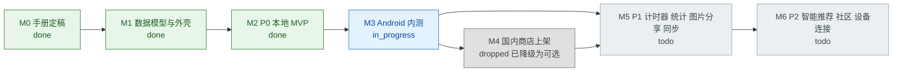
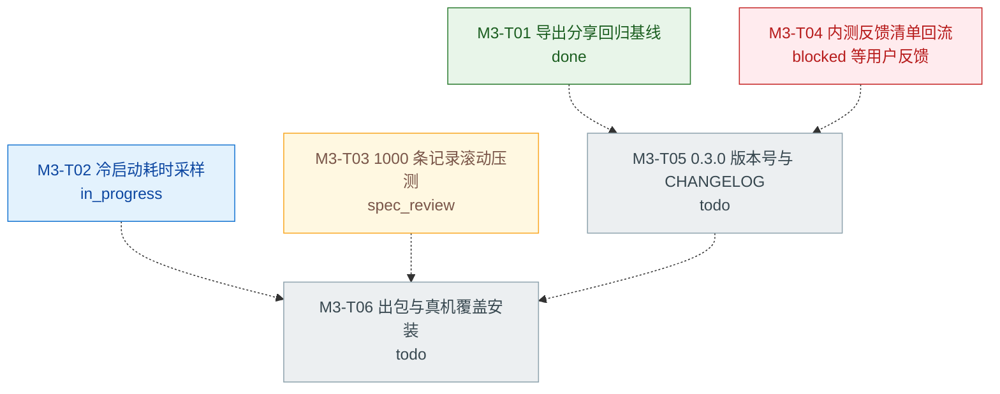
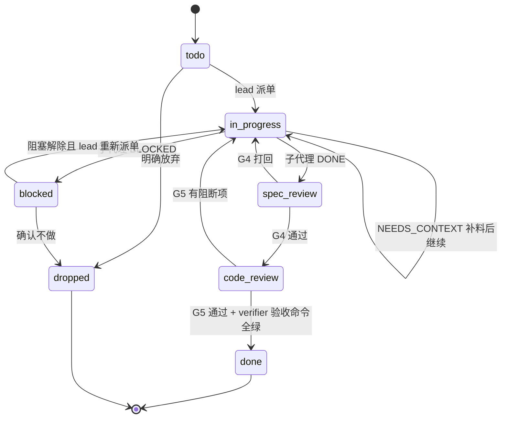
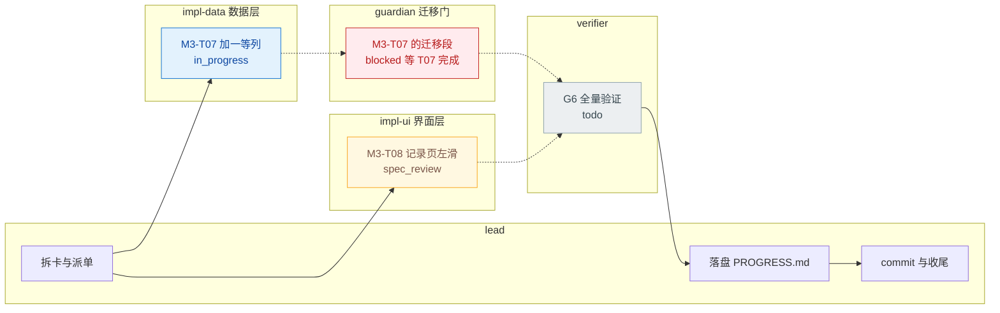
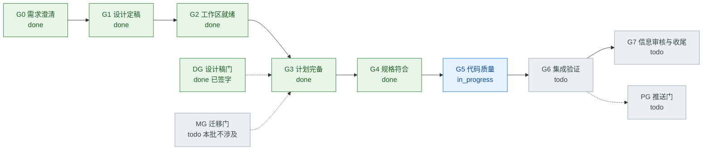
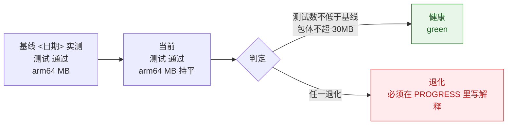
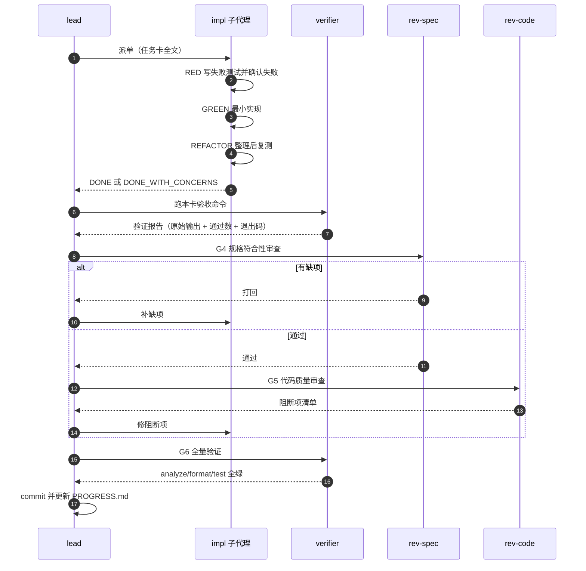
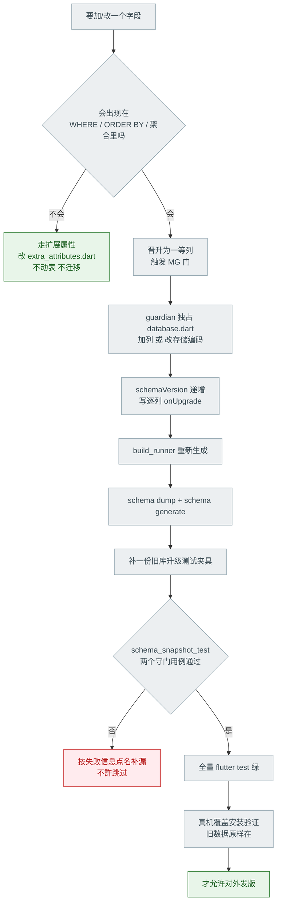
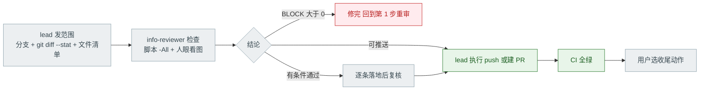

# Mermaid 图集 · 母版库

> 这里放**进度图的母版**，复制到 [`PROGRESS.md`](PROGRESS.md) 或聊天里即可用。
> 读者是 `lead`；人只需要看图，不需要读这一页。
>
> 图的**口径**（状态词、颜色、刷新时机）由
> [`AgentTeams-开发手册.md`](AgentTeams-开发手册.md) §9 定义，本页只给实现。

---

## 0. 语法红线（先看这个，否则图会裂）

进度图有两个消费者：**GitHub 的 Markdown 渲染**和 **Obsidian**。两者的 Mermaid 版本都落后于最新发布版，
所以只用**两边都稳的图型**：

| ✅ 允许 | ❌ 禁止 | 原因 |
|---|---|---|
| `flowchart`（`LR` / `TD`） | `xychart-beta` | GitHub 不支持，图裂 |
| `stateDiagram-v2` | `quadrantChart` | 同上 |
| `sequenceDiagram` | `%%{init}%%` 主题指令 | 两边渲染差异大，可能整段报错 |
| `gantt` | `click` / `linkStyle` | GitHub 出于安全会禁用 |
| `pie` | `journey` | 排版在窄屏不可读 |

另外五条硬规矩：

1. **节点 id 只用 ASCII**（`T01`、`G4`、`M3`），中文一律放**标签**里。
2. **标签一律加英文双引号**：`T01["M3-T01 导出回归"]`。
   不加引号时，标签里的 `(`、`[`、`:`、`；` 会让解析器当场报错。
3. **不要在标签里写 `#`**（它会被当实体编码）。要用序号就写「第 N 步」。
4. **`classDef` / `class` 是唯一的着色方式**，颜色用十六进制。
5. **同一张图里的状态词只能来自手册 §9.5 的七个**：`todo` / `in_progress` / `spec_review` / `code_review` / `blocked` / `done` / `dropped`。

---

## 1. 颜色与状态约定

把这一块**原样复制**到每张 `flowchart` 的末尾（改完节点后照着 `class` 一行）：

```
    classDef todo fill:#eceff1,stroke:#90a4ae,color:#37474f
    classDef doing fill:#e3f2fd,stroke:#1976d2,color:#0d47a1
    classDef review fill:#fff8e1,stroke:#f9a825,color:#795548
    classDef blocked fill:#ffebee,stroke:#c62828,color:#b71c1c
    classDef done fill:#e8f5e9,stroke:#2e7d32,color:#1b5e20
    classDef dropped fill:#e0e0e0,stroke:#757575,color:#424242
```

| 状态 | 颜色 | 含义 |
|---|---|---|
| `todo` | 灰 | 已建卡，未派单 |
| `in_progress` | 蓝 | 子代理正在写 |
| `spec_review` / `code_review` | 琥珀 | 两阶段审查中 |
| `blocked` | 红 | 有阻塞，必须在阻塞表里有条目 |
| `done` | 绿 | 两阶段审查 + 验证命令全过 |
| `dropped` | 深灰 | 明确放弃（要写原因） |

---

## 2. 图 1 · 里程碑总览

**回答**：我们现在在 M 几？
**刷新时机**：迭代收尾；里程碑状态变化时。



> 里程碑定义见 [`BeanClick-开发手册-v0.2.md`](../BeanClick-开发手册-v0.2.md) §16；
> M4 已降级为可选（[`README.md`](../../README.md) 里程碑小节）。

---

## 3. 图 2 · 任务 DAG

**回答**：这批要做几张卡、谁挡着谁？
**刷新时机**：每张卡状态迁移；依赖变化时。
**规矩**：`blocked_by` 画成**虚线箭头**，方向 = 依赖方向（A 依赖 B 就画 `B -.-> A`）。



---

## 4. 图 3 · 任务状态机

**回答**：单张卡走到哪一步了、下一步是谁？
**刷新时机**：只在**流程本身**改动时改这张图（它是规则图，不是进度图）。



---

## 5. 图 4 · 迭代泳道（谁在干什么）

**回答**：并行度如何、有没有人在热点文件上排队？
**刷新时机**：派单 / 收单时。



> 泳道**按写作用域分**，不按人分。这样一眼就能看出"两张卡是不是压在同一个热点文件上"。

---

## 6. 图 5 · 门禁与健康度

**回答**：有哪些门没过？测试数和包体有没有退化？
**刷新时机**：每个门禁通过/失败；每天收工。

门禁状态图：



健康度用**表格化的 flowchart 节点**，不要用 `xychart-beta`（GitHub 不支持）：



> 数字必须来自 `verifier` 的原始输出。**容量指标只有三个**：测试通过数、包体（arm64）、
> 启动耗时（M3 起有采样才填）。别自己加指标——指标一多就没人维护。

---

## 7. 图 6 · 单卡生命周期（时序）

**回答**：一张卡从派单到合并经过谁？
**刷新时机**：流程改动时（规则图）。



---

## 8. 图 7 · 迁移门决策树（MG）

**回答**：这次改动到底要不要动 schema？
**刷新时机**：每次有字段类改动时；这张图常年不变，直接复用。



---

## 9. 图 8 · 推送门（PG）与分支收尾



收尾动作四选一（**问用户，不自己拍板**）：建 PR / 本地合并 / 保留分支 / 丢弃 worktree。

---

## 10. 聊天里的迷你进度条

任何一次状态汇报都可以带这一行图（≤6 个节点，只高亮当前阶段）：


纯文本汇报（不渲染图也能看懂，**必须带数字**）：

```text
M3-T02 冷启动采样 → G4 通过，进入 G5
门禁：G4 ✅ | G5 进行中 | DG 已签字 | MG 本批不涉及
测试：<基线 n> → <当前 n+Δ>（+Δ）| 退出码 0
包体：arm64 <x> MB（无变化）
阻塞：M3-T04 等用户内测反馈（解除条件：Releases 收到 issue）
下一动作：rev-code 审 M3-T02 的采样脚本改动
```

---

## 11. 怎么改（三个最高频的编辑场景）

### 11.1 新增一张卡

1. 在**图 2 任务 DAG** 里加一个节点，状态 `todo`，加进对应的 `class` 行。
2. 在 `PROGRESS.md` 的任务表里加一行（ID / 目标 / scope / 依赖 / 状态）。
3. 有依赖就在 DAG 上加一条**虚线**边。
4. 在**图 4 泳道**里放到对应 role 的 `subgraph`。

### 11.2 一张卡被阻塞

1. 改节点标签里的状态为 `blocked`，把 `class` 行挪到 `blocked`。
2. 在 `PROGRESS.md` **阻塞表**里加一行：卡号 / 阻塞原因 / 解除条件 / 谁负责。
3. **不许只在图上标红而不写解除条件** —— 无解除条件的阻塞等于没有阻塞。

### 11.3 迭代收尾

1. 图 1 里程碑总览更新状态。
2. 图 2 的 `done` 节点可以整批删掉，只留未完成的（历史进 `plans/` 归档）。
3. 图 5 健康度更新基线与当前值。
4. 图 4 泳道清空。

---

## 12. 自查清单（提交前过一遍）

- [ ] 没有用 `xychart-beta` / `quadrantChart` / `%%{init}%%` / `click` / `linkStyle`
- [ ] 所有节点 id 都是 ASCII
- [ ] 所有标签都带英文双引号，标签里没有裸的 `(` `[` `:` `#`
- [ ] 用到的状态词都在手册 §9.5 的七个之内
- [ ] `classDef` 块完整，且每个节点都被某个 `class` 覆盖（漏了会显示默认色，一眼能看出）
- [ ] 每个 `blocked` 节点在 `PROGRESS.md` 阻塞表里都有对应行，且有解除条件
- [ ] 数字（测试数 / 包体 / 耗时）来自 `verifier` 的原始输出，不是估计
- [ ] 图里的时间戳与 `PROGRESS.md` 顶部的"最后更新"一致
