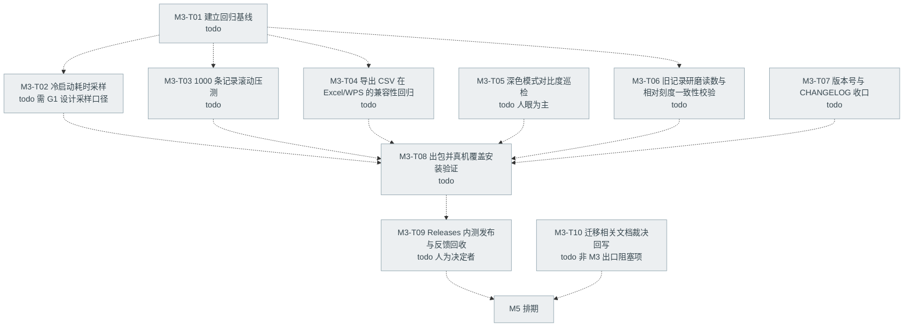
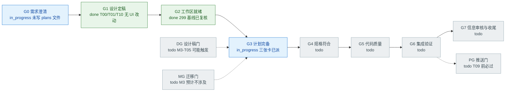
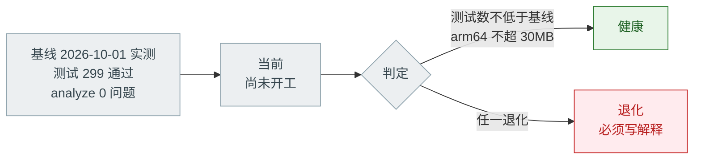

# 开发进度看板 · PROGRESS

> **唯一真相源。只有 `lead` 能写这个文件。**
> 不在这个文件里的进度，等于不存在。
>
> | 项 | 值 |
> |---|---|
> | 最后更新 | 2026-10-01（组队 + G2 就绪 + 派 T00/T01/T10） |
> | 更新人 | `lead` |
> | 当前里程碑 | **M3 Android 内测**（G2 已过，首批 3 张卡 `todo`） |
> | 已发布 | `v0.2.0`（= M0–M2.11，schema v7） |
> | 回归基线 | ✅ **已实测（2026-10-01）**：`flutter test` = **299 通过 / 退出码 0**；`flutter analyze` = `No issues found!` / 退出码 0；`dart format --output=none --set-exit-if-changed .` = 0 处改动 / 退出码 0。Flutter 3.47.5 · Dart 3.13.4 |
> | 工作分支 | `feat/m3-intake` @ `4ec919c`；worktree = `<工程根目录上级>\BeanClick-m3-intake`（G2 已由 `verifier` 复核通过，见 §6） |
> | 主分支 | `main` 干净；唯一未跟踪项 `docs/agent-teams/` 由 **M3-T00** 处理 |
>
> > ⚠️ **实测 299，而 README 记 297、`docs/DEVELOPMENT.md` §11 仍停在 M2.9 的 292。**
> > 三处不一致本身就是"基线必须实测"的活证据：照抄文档写出来的基线是错的。
> > M3-T01 的产出之一就是把这个数字收口回 README 与 DEVELOPMENT §11。
>
> **记账规则**：只有**真实发生过**的事才能标 `done`；预估、计划、口头承诺一律留在 `todo`。
> 状态词只用七个：`todo` / `in_progress` / `spec_review` / `code_review` / `blocked` / `done` / `dropped`。
> 图的母版与语法红线见 [`Mermaid-图集.md`](Mermaid-图集.md)。

---

## 0. 团队编制（当前）

> 按手册 §3.4「最小可跑编制」的 **3 人档**组建：`lead` + `guardian` + `verifier`。
> 实现类任务（`impl-data` / `impl-ui` / `impl-test`）**不常驻**，按卡临时派 subagent 兼任。

| 席位 | 谁 | 写作用域 | 明确禁区 | 技能卡 | 状态 |
|---|---|---|---|---|---|
| `lead` | 本会话主持人（AI） | `docs/agent-teams/**`、任务板、git 操作 | 不亲自改产品代码（改了就没人能审） | lead-orchestration | in_progress |
| `guardian` | teammate `guardian` | `lib/data/database.dart`、`database.g.dart`、`test/drift/**`、迁移夹具 | 不改 UI 层、不碰 git | drift-migration-guard | 待命（MG 预判已交） |
| `verifier` | teammate `verifier` | 只写验证报告 | 不改产品代码 / 测试、不碰 git | verify-before-done | 待命（G2 基线已独立复核） |
| `info-reviewer` | teammate `info-reviewer` | 只写审核报告 | 不碰 git、不改产品代码 | pre-push-info-review | 待命（PG 门触发时叫醒） |

> **`info-reviewer` 席位的用户裁决（2026-10-01）**：**保留为常驻第 4 席**。
> 它超出手册 §3.4 的 3 人档（那里把它列在 7 人档），但它由用户在组队之前**单独授权为常驻推送门**
> （[`REVIEW-BEFORE-PUSH.md`](../REVIEW-BEFORE-PUSH.md)）。M3-T09 要发 Release，PG 门必过，必须有它。
> 所以当前实际编制是：**3 人开发编制（lead / guardian / verifier）+ 1 个已授权的守门席位**。

**尚未常驻、按卡临时派**：`impl-data` / `impl-ui` / `impl-test` / `rev-spec` / `rev-code`。

---

## 1. 里程碑总览

**M2 已交付内容**（细节见 [`README.md`](../../README.md) 里程碑小节与 [`CHANGELOG.md`](../CHANGELOG.md)）：
记录 / 豆库 / 复制上次 / 导出 JSON+CSV / 批次 / 多豆拼配 / 扩展属性 / 自定义方法与辅料 /
测评反馈 / 圈+click 研磨刻度 / 图标尺寸对齐。schema v7，四个 tab 外壳 + 可自定义冲煮方法。

**M3 的出口**（[`README.md`](../../README.md) 里程碑）：Android 内测 —— 出包、发 GitHub Releases、
拿到真实设备反馈、把反馈回流成下一批任务。

---

## 2. M3 任务 DAG

> ⚠️ **本节是候选拆分草案，全部为 `todo`，尚未派单。**
> Lead 在 G0/G1 澄清后重排依赖，再逐张派单。

---

## 3. 任务表

| ID | 目标（一句话，可判定） | 写作用域 | 依赖 | 状态 | 负责人 |
|---|---|---|---|---|---|
| M3-T00 | 把 `docs/agent-teams/` 的 **14 个文件**纳入版本控制（当前只在主工作区、未跟踪状态），使这套流程本身可被他人读到 | `docs/agent-teams/**` | 无 | todo | `lead` |
| M3-T01 | 把**实测基线**（299 通过）收口回 `README.md` 状态行与 `docs/DEVELOPMENT.md` §11，并说明测试数是何时测的 | `README.md`、`docs/DEVELOPMENT.md` | 无 | todo | `lead`（原写 `verifier`，见下方注） |
| M3-T02 | 定出冷启动耗时的**采样口径**（冷启动定义、设备、次数、取哪个分位）并落地一次实测记录 | `docs/`、`tool/` | T01 | todo | `verifier` + 人 |
| M3-T03 | 造 1000 条记录后确认时间线列表滚动无可感卡顿，并记录造数手段 | `tool/`、`test/` | T01 | todo | `impl-test` |
| M3-T04 | 确认导出 CSV 带 BOM、中文表头在手机端 Excel/WPS 不乱码、分享面板正常弹出 | 无代码改动（人机测试） | T01 | todo | 人 |
| M3-T05 | 逐屏巡检深色模式对比度，产出问题清单（只清单，不改代码） | `docs/` | 无 | todo | 人 |
| M3-T06 | 校验旧记录（0.1.0 时期的小数圈数）与新相对刻度算法算出来的值对得上 | `test/` | T01 | todo | `impl-test` |
| M3-T07 | `pubspec.yaml` / `kAppVersion` / `CHANGELOG` 三处版本号一致收口到 0.3.0 | `pubspec.yaml`、`lib/core/app_info.dart`、`docs/CHANGELOG.md` | T02–T06 | todo | `impl-data` |
| M3-T08 | 出 arm64 / armeabi-v7a 包，`apksigner verify` 确认非 debug 签名，真机覆盖安装后旧数据原样在 | 无代码改动 | T07 | todo | `verifier` |
| M3-T09 | 发 GitHub Releases 并把 [RELEASING §4](../../RELEASING.md) 的重点反馈清单贴进 Release 说明 | `RELEASING.md` | T08 | todo | 人（决定者） |
| M3-T10 | 把迁移相关的过期/冲突文档按裁决回写（详见 §8 的 row 2 / 3 / 4 / 8），措辞已由 `guardian` 备好 | `docs/添加新属性指南.md`、`docs/M1-DATA-MODEL.md`、`CONTRIBUTING.md` | 无 | todo | `lead` 或 `info-reviewer`（**不是** `guardian`：`docs/**` 不在其 scope） |

> **本表不含**「等内测反馈回来的修复任务」——那要等 T09 之后按真实 Issue 建卡，不许提前编。

> **M3-T01 负责人从 `verifier` 改成 `lead`**（2026-10-01 裁决）：`verifier` 的技能卡把它的写作用域定为
> **"只写验证报告"**，而 T01 要改 `README.md` / `docs/DEVELOPMENT.md` —— 那是 `docs/**`，按 §4.1 归
> `lead` + 各任务作者。数字由 `verifier` 提供证据（已交：两次复跑 299），**落盘由 Lead 做**，
> 这样"测量者"与"记录者"分离，同时不越 `verifier` 的只读边界。

### 3.1 `guardian` 预判产出的三条**卡片限定条件**（写卡时必须带上）

> 来源：`guardian` 的 M3 MG 门预判（2026-10-01，只读）。M3 九张卡**没有一张触发 MG 门**，
> 但下面三条边界不写进卡里，就会在实现时被"顺手"越过。

| 卡 | 必须写进卡的限定 |
|---|---|
| M3-T03 | 造数**只用现有列与现有 API**；禁止改 `lib/data/database.dart`、禁止动 `test/drift/**`、**不许为压测临时加索引** |
| M3-T06 | **唯一带 MG 潜伏分支的卡**：若校验结论是"历史存储值需要改写"（例如要彻底收敛 `scaleUnit`）→ **停下报 `BLOCKED`，转 MG 卡**，不得顺手加迁移 |
| M3-T07 | `0.3.0` 是**应用版本**（`pubspec.yaml` / `kAppVersion`），与 `AppDatabase.schemaVersion`(=7) **是两回事**；卡里必须显式写"禁止触碰 `lib/data/database.dart`" |

---

## 4. 迭代泳道

> 泳道里刻意留了「人」这一列：**豆刻有一批任务代理做不了**（真机观感、发版决定、产品取舍），
> 把它们画出来才不会出现"以为代理能做、结果没人做"的黑洞。

---

## 5. 门禁状态

**本批特区门预判**：

| 门 | 会不会触发 | 说明 |
|---|---|---|
| DG 设计稿门 | 可能 | 若 M3-T05 巡检后决定改配色 / 间距结构 → 触发 |
| MG 迁移门 | **预计不涉及** | M3 是内测与回归，不改表；一旦有人提出加列，走 §7 七步 |
| PG 推送门 | **必过** | T09 发 Release 前；范围一变（哪怕多一张图）就重审 |

---

## 6. 健康度

只维护三个指标，多一个都不加：

| 指标 | 基线 | 当前 | 阈值 |
|---|---|---|---|
| 测试通过数 | **299**（2026-10-01，`verifier` 独立复跑两次均 299，退出码 0，0 skip） | — | 不得低于基线 |
| APK 包体（arm64-v8a） | 21.0 MB（0.2.0，**本次未复测**） | — | < 30 MB |
| 冷启动耗时 | 未采样 | — | < 1.5 s |

> 基线命令与原始输出：`flutter test` → `00:19 +299: All tests passed!`（退出码 0，复跑 `00:15 +299`）；
> `flutter analyze` → `No issues found! (ran in 3.1s)`（退出码 0）；
> `dart format --output=none --set-exit-if-changed .` → `Formatted 64 files (0 changed)`（退出码 0）。
> **任何"没退化"的结论都必须相对这三行数字，而不是相对 README 里的说明。**
>
> **两条口径澄清**（否则将来的对账会出错）：
> 1. 这份基线是**在 `main` 工作区**取的（当时 `git diff` 为空、零源码改动），**不是**在 G2 要求的
>    独立 worktree 里 —— M3 尚无工作分支。派 T01 时若按 G2 字面建 worktree，需在 worktree 内**重取一次**。
> 2. HEAD 上 `flutter test` 会打印 **107 处** drift debug 警告
>    （`It looks like you've created the database class AppDatabase multiple times`）。`verifier` 抽样定性为
>    「测试内多次构造 `AppDatabase`、仅 debug 打印、不影响计数与退出码」，**非本次新增**。
>    它**没有**逐条证明两两不共享 `QueryExecutor` —— 该结论列在未验证项里，不替它背书。

---

## 7. 阻塞表

| 卡号 | 阻塞原因 | 解除条件 | 谁负责 | 记录时间 |
|---|---|---|---|---|
| — | 当前无阻塞 | — | — | — |

> 规则：图上标红而这里没有条目，视为**未记录阻塞**，等于没有阻塞。
> 每条必须有**可判定的解除条件**，不许写"等一等"。

---

## 8. 已知文档缺陷（待建卡）

> 这些是写这套 Agent Teams 文档时**发现的既有文档问题**。
> 按"范围一变就重审"的规矩**没有顺手改**——改既有文档要单独建卡、单独过 G7。
> 在它们被修掉之前，**以本文件与实跑输出为准**。

| # | 位置 | 问题 | 为什么危险 | 建议动作 |
|---|---|---|---|---|
| 1 | `README.md` 状态行 / `docs/DEVELOPMENT.md` §11 | 测试数记 297 / 292，实测是 **299** | 照抄当基线 → 基线是错的，"没退化"结论失效 | 已并入 M3-T01 |
| 2 | `docs/添加新属性指南.md` §2.2（:102） | 示例 `int get schemaVersion => 5; // 从 4 递增` 已过期（当前 **7**） | 🔴 **比原来写的严重**：`guardian` 追了 drift 2.35.0 源码——写小 → drift 认为发生了升级 → 把 `PRAGMA user_version` **静默降回**旧值（不报错）→ 修好后重新发版时 `from` = 那个旧值 → 迁移段对已存在的列再跑 `addColumn` → `duplicate column name` → **库打不开、App 起不来**。盘上数据大概率还在，但用户打不开 | 删掉具体数字 + 补"禁止把版本号写小"的后果说明（措辞见下方「裁决文本」） |
| 3 | `docs/添加新属性指南.md` §7 检查清单（:304-316）；`CONTRIBUTING.md` :66-75 同类 | 漏项**不止一条**：缺 ③`build_runner` 重新生成、⑤补「旧库升上来」夹具、⑦真机覆盖安装验证。`M1-DATA-MODEL.md` :229-232 反而是唯一写全了的 | 漏夹具会被守门用例点名（代价=返工一轮）；漏真机验证才有数据风险，但那一步被 MG 第⑦步与 T08 兜着 | 两份清单都补上三条勾选项 |
| 4 | `docs/添加新属性指南.md` §2.2（:118）↔ `docs/DEVELOPMENT.md` §7.4（:221） | 前者"改类型/改主键必须建新表→搬数据→删旧表"且**全篇不提外键级联**；后者"**一律**用 addColumn/dropColumn 不重建表" | 🔴 唯一裁决住在 [`手册 §7.3`](AgentTeams-开发手册.md) 第 6 条，而**迁移卡的输入清单**（`任务卡模板.md`:116）给实现者的是"指南 §2 + DEVELOPMENT §7.4"——**正好是相互冲突的那两份**，裁决不在他的输入里。一旦有人按指南做 → 级联删数据 | 把手册 §7.3 第 6 条回写进指南 §2.2 |
| 5 | `docs/DEVELOPMENT.md` §13.1 | 渲染命令写 `flutter test tool/design_preview/xxx.dart`，真实文件是 `*_test.dart` | 照抄命令找不到文件 | 改成 `<xxx>_test.dart` |
| 6 | `docs/DEVELOPMENT.md` §8.2 | 只提 `await db.close()` 会永久阻塞；`test/helpers/widget_harness.dart` 的注释里写明 `ProviderContainer.dispose()` **同样会** | 换了种写法又踩同一个坑 | 补上 `dispose()` |
| 7 | `docs/M2.10-研磨刻度设计稿.md` | 小节顺序是 §1.1 → §1.2 → §1.3 → **§1.5** → §1.4 | 读起来跳号，引用小节号时容易指错 | 重排编号 |
| 8 | `docs/M1-DATA-MODEL.md` :223 / :226-228 | 写"当前是 **v6**"、"只出现过 1 / 4 / 5 / 6"，迁移列表停在 `_upgradeToV6`，**漏 v7 与 `_upgradeToV7`** | 这是**事实陈述**式的过期（比 row 2 的代码示例更容易被直接照抄），且它正是迁移卡必读的文档 | 改为 v7 并补上 v6→v7 一行 |
| 9 | `docs/agent-teams/任务卡模板.md` :138 | REFACTOR 让"同步 `docs/M1-DATA-MODEL.md` 与**手册 §6** 的字段说明"，但手册 §6 是"任务卡规范"，没有字段说明表 | 引用失效，照做会找不到东西 | 改成只说 `M1-DATA-MODEL.md` |

**已裁决（不必再开卡）**：

| 位置 | 曾经的疑点 | 裁决 |
|---|---|---|
| `docs/CHANGELOG.md` :84（写着 297） | 是过期事实还是发布快照？ | **不改**。0.2.0 发布时确实跑出 297（M2.10 批次的结果），这一行是**如实的历史记录**；299 是之后那批"审核修复 +2 条测试"才到的。`verifier` 提的 scope 缺口据此关闭 |
| `docs/agent-teams/Mermaid-图集.md` :232（"当前 测试 303 通过 +4"） | 是不是又一处过期数字？ | **不改**，它是母版里的**格式示例**（演示"相对基线 +Δ"怎么写），不是事实断言。但它与真实数字太像、容易误读——若哪天顺手整理，把示例值换成 `<n+Δ>` 更稳 |

**待落盘的裁决文本**（`guardian` 产出，措辞可直接粘贴；`docs/**` 归 Lead，等 M3-T10 决定后落）：

- 指南 §2.2 的 `schemaVersion` 示例 → `<现值 + 1>`，并补"⚠️ 禁止把版本号写小 + 后果链"与"⚠️ 改类型/改主键只能重建表，但重建被外键引用的表会级联删数据 → 停下报 `BLOCKED`"两段。
- 指南 §7 与 `CONTRIBUTING` 的清单各补三条勾选项（`build_runner` / 补夹具 / 真机覆盖安装）。
- `M1-DATA-MODEL.md` 三处 v6 → v7 并补 v6→v7 迁移行。

---

## 9. 变更日志（本文件自身的更新记录）

| 时间 | 更新人 | 改了什么 |
|---|---|---|
| 2026-10-01 | `lead` | 初始建板：确立唯一真相源规则、里程碑总览、M3 候选拆分草案（9 张卡全部 `todo`）、门禁状态、健康度三项指标 |
| 2026-10-01 | `lead` | 补实测基线（`flutter test` 299 通过 / analyze 0 问题 / format 0 改动，退出码全 0）；发现 README 记 297、DEVELOPMENT §11 记 292 两处过期，已并入 M3-T01 |
| 2026-10-01 | `lead` | 首次跑 PG 门：`check_upload_safety.ps1 -All` → **BLOCK=0 / WARN=5 / INFO=40，退出码 0**。5 条 WARN 全部是既有二进制与预览图（`assets/icon/app_icon_source.png` 体积、4 张 `tool/**/out/*.png`），**本次新增的 14 个文件零命中**；40 条 INFO 是 `DEVELOPMENT.md` / `RELEASING.md` 里有意写明的工具链路径（§5.7 已注明这类属提示级）。新增 §8「已知文档缺陷（待建卡）」7 条 |
| 2026-10-01 | `lead` | **组建 3 人最小编制团队**（手册 §3.4）：`lead` + `guardian` + `verifier`；新增 §0「团队编制」记录席位、写作用域、禁区与技能卡。`info-reviewer` 作为用户先前单独授权的推送门席位保留待命（超出 3 人档，已在 §0 注明）。派了两件**只读**首活：`verifier` 独立复测 G2 基线、`guardian` 复核「M3 不触发 MG 门」这个预判 |
| 2026-10-01 | `lead` | **收两份首活回报**：`verifier` 交 `DONE`（两次复跑均 299/退出码 0、0 skip、零源码 diff → 基线成立；并指出 T01 scope 缺口）；`guardian` 交 `DONE_WITH_CONCERNS`（9 张卡逐卡判定**均不触发 MG 门**，"MG 预计不涉及"判定正确；追 drift 2.35.0 源码证明 row 2 的后果是「静默降 `user_version` + 修复版因重复加列打不开库」，**严重度上调为 🔴**；新发现 `M1-DATA-MODEL.md` 仍写 v6）。据此：§8 重写并新增 row 8/9 + 「已裁决」小节（CHANGELOG:297 属如实历史、Mermaid 示例不改）、§3 增 `M3-T10` 候选卡与 §3.1 三条卡片限定条件、§6 补基线口径两条澄清（基线取自 main 非 worktree、107 处 drift 警告的定性与未验证边界） |
| 2026-10-01 | `lead` | **用户裁决三项**：① `info-reviewer` **保留为常驻第 4 席**；② 派 **M3-T00 / T01 / T10** 三张卡；③ 隔离方式**严格按手册 §5.4 建 worktree**。据此建 `feat/m3-intake` worktree（`<工程根目录上级>\BeanClick-m3-intake`，@ `4ec919c`），并拷贝 `sqlite3.dll` 与 `.dart_tool/hooks_runner/shared` 两个 gitignore 依赖 |
| 2026-10-01 | `verifier` | **G2 工作区就绪复核通过（task-5，`DONE`）**：worktree 内 `flutter pub get` / `dart format --output=none` 0 改动 / `flutter analyze` 0 问题 / `flutter test` **299 通过（退出码 0，0 skip）**；与 main **逐字节一致**（`database.dart`、`database.g.dart`、`pubspec.lock`、`test/drift/**`）；`git status --short` 空。未跑 `build_runner`（MG 未触发，且那是 guardian 独占资源）。据此 §3 增 `M3-T00` 卡、`M3-T01` 负责人改为 `lead`（依据技能卡的只读边界 + §4.1 的 `docs/**` 归属） |
