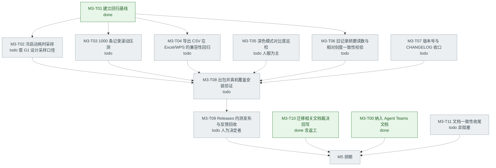
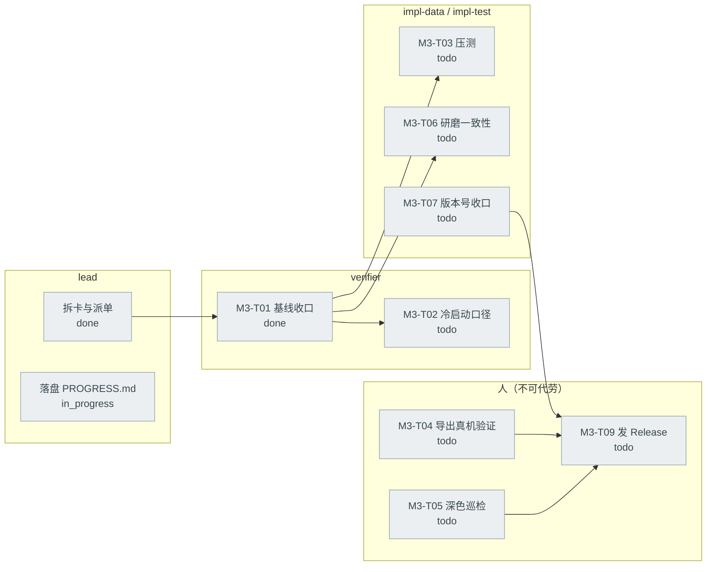
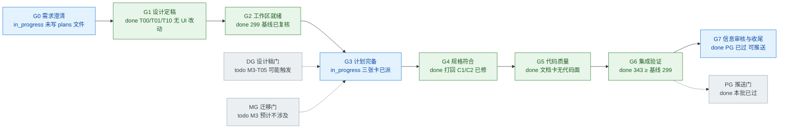
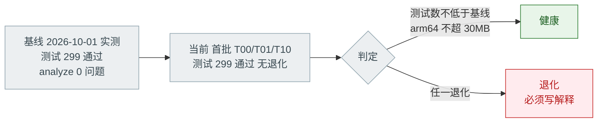

# 开发进度看板 · PROGRESS

> **唯一真相源。只有 `lead` 能写这个文件。**
> 不在这个文件里的进度，等于不存在。
>
> | 项 | 值 |
> |---|---|
> | 最后更新 | 2026-10-01（第二批：用户反馈修复 T12–T25 全部落盘；**G6 已过（343）、PG 门已过（可推送）**，待推送） |
> | 更新人 | `lead` |
> | 当前里程碑 | **M3 Android 内测**（第一批文档 3 张卡 + 第二批反馈修复 10 张卡均已 `done`） |
> | 已发布 | `v0.2.0`（= M0–M2.11，schema v7） |
> | 回归基线 | ✅ **已实测（2026-10-01）**：`flutter test` = **299 通过 / 退出码 0**；`flutter analyze` = `No issues found!` / 退出码 0；`dart format --output=none --set-exit-if-changed .` = 0 处改动 / 退出码 0。Flutter 3.47.5 · Dart 3.13.4 |
> | 工作分支 | `feat/m3-intake`（worktree = `<工程根目录的父目录>\BeanClick-m3-intake`）；`4ec919c` → T00 `2b6a4f8` → T01 `5653d20` → T10 `0a8bdc5` → T10 返工 `e47d08b` |
> | 主分支 | `main` 干净；`docs/agent-teams/` 已由 **M3-T00** 纳入版本控制 |
>
> > ✅ **测试数三处不一致已收口**（2026-10-01，M3-T01）：`README.md` 与
> > `docs/DEVELOPMENT.md` §11 都已改为**实测 299**。此前 README 记 297、DEVELOPMENT 记 292
> > —— 那次不一致本身就是"基线必须实测"的活证据，已写进 DEVELOPMENT §11 当教训。
>
> ⚠️ **本文件是团队内部开发台账**：随每次迭代更新，其中的数字（测试数、包体、行号）会随时间失效。
> **判断代码行为一律以代码与实跑输出为准**，本文件的数字不构成对外承诺。
>
> **记账规则**：只有**真实发生过**的事才能标 `done`；预估、计划、口头承诺一律留在 `todo`。
> 状态词只用七个：`todo` / `in_progress` / `spec_review` / `code_review` / `blocked` / `done` / `dropped`。
> 图的母版与语法红线见 [`Mermaid-图集.md`](Mermaid-图集.md)。

---

## 0. 团队编制（当前）

> 按手册 §3.4「最小可跑编制」的 **3 人档**组建：`lead` + `guardian` + `verifier`。
> 实现类任务（`impl-data` / `impl-ui` / `impl-test`）**不常驻**，按卡临时派 subagent 兼任。

| 席位 | 谁 | 写作用域 | 明确禁区 | 技能卡 | 状态 |
|---|---|---|---|---|---|
| `lead` | 本会话主持人（AI） | `docs/agent-teams/**`、任务板、git 操作 | 不亲自改产品代码（改了就没人能审） | lead-orchestration | in_progress |
| `guardian` | teammate `guardian` | `lib/data/database.dart`、`database.g.dart`、`test/drift/**`、迁移夹具 | 不改 UI 层、不碰 git | drift-migration-guard | 待命（MG 预判已交） |
| `verifier` | teammate `verifier` | 只写验证报告 | 不改产品代码 / 测试、不碰 git | verify-before-done | 待命（G2 基线已独立复核） |
| `info-reviewer` | teammate `info-reviewer` | 只写审核报告 | 不碰 git、不改产品代码 | pre-push-info-review | 待命（PG 门触发时叫醒） |

> **`info-reviewer` 席位的用户裁决（2026-10-01）**：**保留为常驻第 4 席**。
> 它超出手册 §3.4 的 3 人档（那里把它列在 7 人档），但它由用户在组队之前**单独授权为常驻推送门**
> （[`REVIEW-BEFORE-PUSH.md`](../REVIEW-BEFORE-PUSH.md)）。M3-T09 要发 Release，PG 门必过，必须有它。
> 所以当前实际编制是：**3 人开发编制（lead / guardian / verifier）+ 1 个已授权的守门席位**。

**尚未常驻、按卡临时派**：`impl-data` / `impl-ui` / `impl-test` / `rev-spec` / `rev-code`。

---

## 1. 里程碑总览

**M2 已交付内容**（细节见 [`README.md`](../../README.md) 里程碑小节与 [`CHANGELOG.md`](../CHANGELOG.md)）：
记录 / 豆库 / 复制上次 / 导出 JSON+CSV / 批次 / 多豆拼配 / 扩展属性 / 自定义方法与辅料 /
测评反馈 / 圈+click 研磨刻度 / 图标尺寸对齐。schema v7，四个 tab 外壳 + 可自定义冲煮方法。

**M3 的出口**（[`README.md`](../../README.md) 里程碑）：Android 内测 —— 出包、发 GitHub Releases、
拿到真实设备反馈、把反馈回流成下一批任务。

---

## 2. M3 任务 DAG

> 首批 T00/T01/T10 已 `done`（见 §3）；T02–T09 与 T11 仍是候选，`todo`，由 Lead 显式派单。
> Lead 在 G0/G1 澄清后重排依赖，再逐张派单。

---

## 3. 任务表

| ID | 目标（一句话，可判定） | 写作用域 | 依赖 | 状态 | 负责人 |
|---|---|---|---|---|---|
| M3-T00 | 把 `docs/agent-teams/` 的 **14 个文件**纳入版本控制，使这套流程本身可被他人读到 | `docs/agent-teams/**` | 无 | **done**（`2b6a4f8`） | `lead` |
| M3-T01 | 把**实测基线**（299 通过）收口回 `README.md` 状态行与 `docs/DEVELOPMENT.md` §11，并说明测试数是何时测的 | `README.md`、`docs/DEVELOPMENT.md` | 无 | **done**（`5653d20`） | `lead`（原写 `verifier`，见下方注） |
| M3-T02 | 定出冷启动耗时的**采样口径**（冷启动定义、设备、次数、取哪个分位）并落地一次实测记录 | `docs/`、`tool/` | T01 | todo | `verifier` + 人 |
| M3-T03 | 造 1000 条记录后确认时间线列表滚动无可感卡顿，并记录造数手段 | `tool/`、`test/` | T01 | todo | `impl-test` |
| M3-T04 | 确认导出 CSV 带 BOM、中文表头在手机端 Excel/WPS 不乱码、分享面板正常弹出 | 无代码改动（人机测试） | T01 | todo | 人 |
| M3-T05 | 逐屏巡检深色模式对比度，产出问题清单（只清单，不改代码） | `docs/` | 无 | todo | 人 |
| M3-T06 | 校验旧记录（0.1.0 时期的小数圈数）与新相对刻度算法算出来的值对得上 | `test/` | T01 | todo | `impl-test` |
| M3-T07 | `pubspec.yaml` / `kAppVersion` / `CHANGELOG` 三处版本号一致收口到 0.3.0 | `pubspec.yaml`、`lib/core/app_info.dart`、`docs/CHANGELOG.md` | T02–T06 | todo | `impl-data` |
| M3-T08 | 出 arm64 / armeabi-v7a 包，`apksigner verify` 确认非 debug 签名，真机覆盖安装后旧数据原样在 | 无代码改动 | T07 | todo | `verifier` |
| M3-T09 | 发 GitHub Releases 并把 [RELEASING §4](../../RELEASING.md) 的重点反馈清单贴进 Release 说明 | `RELEASING.md` | T08 | todo | 人（决定者） |
| M3-T10 | 把迁移相关的过期/冲突文档按裁决回写（详见 §8 的 row 2 / 3 / 4 / 8），措辞已由 `guardian` 备好 | `docs/添加新属性指南.md`、`docs/M1-DATA-MODEL.md`、`CONTRIBUTING.md` | 无 | **done**（`0a8bdc5` + 返工 `e47d08b`） | `lead` |
| M3-T11 | 文档一致性收尾三项：C3（`M1-DATA-MODEL` 写"7 项默认设置"，实际 `SettingsKeys.all` 是 **8 项**）、C4（`DEVELOPMENT §7.4` 仍缺"改类型/改主键是另一类"的豁免）、§8 row 9（任务卡模板引用了不存在的"手册 §6 字段说明"） | `docs/M1-DATA-MODEL.md`、`docs/DEVELOPMENT.md`、`docs/agent-teams/任务卡模板.md` | 无 | todo | `lead` |

> **本表不含**「等内测反馈回来的修复任务」——那要等 T09 之后按真实 Issue 建卡，不许提前编。

### 3.2 第二批：用户反馈修复（2026-10-01，`fix/feedback-round2`）

> 用户第二轮反馈共 8 项真 bug + 3 项建议。其中 **5 项落在热点文件
> `brew_log_form_page.dart`（真值 2075 行）** → 按 §4.2 只能一个写者，拆成 T12 / T15 **串行**；
> 其余文件不相交，可并行。基线 **299**（`verifier` 在 worktree 内实测）。

| ID | 目标（一句话，可判定） | 写作用域 | 依赖 | 状态 | 负责人 |
|---|---|---|---|---|---|
| M3-T12 | 方法行「＋」去重（一个 chip 画了两个加号）+ 辅料行三框对齐且数量框能显示 4 位数 + 四个核心参数加保守上下限 + 记录里豆子必填 | `brew_log_form_page.dart`、`test/features/*`（1 个） | 无 | **done**（`DONE_WITH_CONCERNS`，见下） | `impl-ui`（临时） |
| M3-T13 | 版本号 `0.2.0+2` → `0.3.0+3`（pubspec 与 `kAppVersion` 两处同改，守卫测试已存在） | `pubspec.yaml`、`lib/core/app_info.dart` | 无 | **done**（299 未退化） | `impl-data`（临时） |
| M3-T14 | 新增豆子时烘焙日期与剩余克数必填（编辑既有豆子不强制） | `lib/features/beans/bean_form_page.dart`、`test/features/bean_form_test.dart` | 无 | **done**（`DONE_WITH_CONCERNS`） | `impl-ui`（临时） |
| M3-T15 | 拼配改成**直接填克数**（占比自动算、只读展示）+ 总时间改**分/秒两个框** + **相对刻度改用磨豆机当前校准**（当前零点 / 每圈 click，磨豆机缺失时回落记录快照） | `brew_log_form_page.dart`、`lib/features/record/record_page.dart` | **T12**（同热点文件） | **done**（`DONE_WITH_CONCERNS`，**未动 schema**） | `impl-ui`（临时） |
| M3-T18 | **修正「豆子必填」的判定条件**：改为**仅当豆库非空**时才强制选豆（空库放行、允许存为"未指定"），并相应更新 `batch1_ui_test.dart` 里 T12 加的那条测试 + 新增"空库可保存"用例 | `brew_log_form_page.dart`、`test/features/batch1_ui_test.dart` | **T15**（同热点文件） | **done**（判定条件 +2 条测试） | `impl-ui`（临时） |
| M3-T19 | **把被 T15 推翻交互的测试改到新口径**：`blend_form_test.dart` 5 条（填占比+总粉量可编辑 → 填克数+占比只读+总粉量求和；含"占比合计 100%"那条的处置）、`widget_test.dart:288`（`brew.totalTime == '120'` → 分/秒两框） | `test/features/blend_form_test.dart`、`test/widget_test.dart` | **T15** | **done**（5 红全修；条数不变 delta=0） | `impl-test`（临时） |
| M3-T20 | **处置 G4 的 F1/F3/F4**：F1 修本批引入的回归（`_secondsText(0)` 返回空串 → 打开 0 秒旧记录再保存会把 0 写成"未记录"，1 行修法 + 往返测试）；F3 给拼配总分越界分支补测试（`60 + 60 = 120 g`，卡外新增但零覆盖）；F4 收紧豆子列表 loading 窗口（loading 且列表为空时拦下并提示，`hasError` 仍放行） | `brew_log_form_page.dart`、`test/features/blend_form_test.dart`、`test/features/batch1_ui_test.dart` | 无 | **done**（327 → 337） | `impl-ui`（临时） |
| M3-T21 | **修 `entities.dart` 里与本批定稿相反的注释 + 死方法**：`Grinder.relativeClicks` 的文档仍写"用记录里的快照、重新校准零点不会重新解释历史读数"（现在行为正相反），且该实例方法**已无任何调用点** → 改注释（必要时删除死方法） | `lib/domain/entities.dart` | 无 | **done**（注释改成当前行为 + 删死方法，+13/−12） | `impl-data`（临时） |
| M3-T22 | **处置 G5（rev-code）的阻断项 B1 与 S1/S2/S3**：①**上下限只对"本次改动过的值"生效**（值等于库里原值即放行），这样既能修 B1（既有 ≥3600 秒的记录不再被锁死），又能覆盖 `dose/water/waterTemp` 的同类历史数据；②`_validateMinutes` 上限 59 → **60**，让"总时间 ≤3600 秒"这个承诺真正可达（60:00），补 60:00 round-trip 测试；③**S1**：在 `_save()` 里补一层**不依赖控件**的范围兜底（`FormState.validate()` 只校验在册字段，滚出视口的输入框会被 ListView 销毁 → 越界值可静默存下）；④**S2**：`_removePick` 空克数不要写 `'0'`、极小粉量拆半不要预填 0；⑤**S3**：ⓘ 弹窗按"当前值 / 快照"分别措辞（别把快照说成"这台磨豆机"的值） | `brew_log_form_page.dart`、`test/features/batch1_ui_test.dart`、`test/features/blend_form_test.dart` | **T20**（同热点文件） | **done**（327 → **337**；S1 的漏洞经 RED 实证：字段真被销毁、`3001` 曾被静默存下） | `impl-ui`（临时） |
| M3-T25 | **把 T22 的「原值放行」语义补到拼配路径**（G4 定点复核的 F1/F2）：**F2** 拼配总分与每支克数都没有"等于原值就放行"的豁免 → 旧拼配记录（总分 >100 g，如本批加限前记的 120 g）**打开不飘红、但一保存就被拦，连改备注都存不下去**；250/250 那种更旧的一打开就行内飘红 —— 而单支的同类记录是豁免的，属**单支/拼配语义不一致**。**F1** 拼配每支的「0.1–100 g」只在行内、保存路径完全不看 → 填 `0.05 g` 再把该行滚出视口（ListView 反注册）能落库。要求：给 `_BeanPick` 加 `originalGrams`、总分加原值豁免、`_validatePicks` 的每支检查提到与行内同口径（文案同一字符串） | `brew_log_form_page.dart`、`test/features/blend_form_test.dart`、`test/features/batch1_ui_test.dart` | **T22** | **done**（337 → **343**；拼配与单支共用同一入口 `_gramsRangeError`） | `impl-ui`（临时） |
| M3-T23 | **【预存在，非本批引入】编辑路径的余量回补不带 batchId**：`brew_log_repository.dart` 的 `adjustStock(beanId, delta)` 不传批次 → 仓储自动挑"有余量+烘焙日期最新"的那袋，多袋同豆时回补可能落到**另一袋**（新建路径是带 batchId 的）。本批把"改克数"变成常用操作，风险放大 → 建议单开卡 | `lib/data/repositories/brew_log_repository.dart`（+ `BeanUsage` 侧映射） | 无 | todo | 待定 |
| M3-T26 | **【可维护性】把核心参数的上下限抽成命名常量**（PG 门的 C 类发现）：`brew_log_form_page.dart` 里 `'0.1–100 g'` 出现 **4 次**、`'0–2000 g'`/`'0–100 ℃'`/`'0–59'`/`'0–60'` 各 2 次，`min:`/`max:` 数值每位点重写，且 `:539` 有一条**独立的消息字面量**没走 `_gramsRangeError`。`:2151` 的注释声称"范围与文案不会在两侧不一致"——那只对同一个 helper 成立，**值本身仍是复制的**。建议抽 `_NumRange` 值对象（label/range/min/max + errorFor），收益：11 处用户可见文案与**断言它们的那批测试**在调参时不会半改半不改。非阻断，提示级 | `lib/features/record/brew_log_form_page.dart` | 无 | todo | 待定 |
| M3-T27 | **修 `docs/M2.10-研磨刻度设计稿.md` 的节号乱序**（`PROGRESS §8` row 7：`1.1 → 1.2 → 1.3 → **1.5** → 1.4`，`verifier` 第三轮复核时再次确认仍在）。本轮虽然改过该文件（+6 行"落地补充"），但**刻意不顺手改**——改了就作废 G6 的 16 文件哈希锚点 | `docs/M2.10-研磨刻度设计稿.md` | 无 | todo | 待定 |
| M3-T24 | **【测试基础设施】`test/helpers/widget_harness.dart` 的覆盖会跨测试泄漏**：`useOverrides` 把 builder 存在 harness 实例上，`reset()` 每次又重新应用 → **前一个测试的 provider 覆盖会延续到后面的测试**。实证：`batch1_ui_test.dart` 末尾那组把 `beanListProvider` 覆盖成 error 之后，**任何追加在它后面的测试都会拿到空豆库**（M3-T22 的第一版 RED 因此全挂，它只能用局部 `setUp` 兜住）。这属**静默串味**，既可能造假红也可能造假绿 → 必须修 harness 本人。附带记录另一个测试坑：`fillField` 后只 `pump()` 一帧时，输入框获焦会带动 ListView 滚动动画，此刻按 key/tooltip 算出的坐标是中间帧 → `tap()` miss（需 `pumpAndSettle()`） | `test/helpers/widget_harness.dart` | 无 | todo | 待定 |

| M3-T16 | 建议类（待排期、未开工）：辅料可填具体牌子、自定义收藏夹（记录组）、豆库/磨豆机按购买总量·消耗总量·花费·单价·复购次数排序 | 待定 | 无 | todo | 待定 |

**用户对「豆子必填」的裁决（2026-10-01）**：**豆库为空时放行** —— 一支豆子都没有时允许以
"未指定豆子"保存（首杯零阻力，符合手册 §8 快速记录）；一旦豆库已有豆子，就必须选一支。
`lead` 已核实：T12 报告的 4 条被撞红的既有测试**全部运行在空豆库下**
（`test/features/batch2_ui_test.dart` 里没有 `addBeanWithBatch`；`test/widget_test.dart` 的两条
快速记录在首个建豆用例之前）→ **按新规则会自动恢复绿，不需要改这 4 条测试的夹具**。
所以原本计划的"改夹具"卡（T17）**取消**，改为 T18 修正判定条件本身。

**T12 的实现细节（留档）**：辅料行**统一 48dp 高**、数量框 **88dp**、单位框 **72dp**、删除按钮 compact；
必须 48 的原因是实现者实测：名称 `InputDecorator` 自然高 44、`NumberField` 自然高 48，
只套 `SizedBox` 时边框仍按自然高绘制、对不齐，故给两个 `InputDecorator` 加 `expands: true`。
RED 证据里带原始尺寸 `name=Size(116.0, 44.0) amount=Size(58.0, 48.0)`。

**T15 的 Key 变更清单（重要：后续卡与审查都要按这个表）**：

| Key | 变更 |
|---|---|
| `brew.beanGrams.$i` | **新增**：拼配每支的克数输入框（suffix `g`） |
| `brew.share.$i` | Key 名**保留**、**语义变更**：占比 % 可编辑框 → 同行**只读**占比文字（`占比 70%`），不能再 `fillField` |
| `brew.totalTime` | **已删除** → 拆成 `brew.totalTimeMin` + `brew.totalTimeSec`（两个新 Key） |
| `brew.dose` | **保留**：单支时仍是可编辑 `NumberField`；**拼配时是只读的自动求和展示**（同 Key，不再是 `EditableText`） |

T15 还额外加了一处卡上没写的校验（已请 G4 认）：**拼配总分越界拦保存**（`粉量应在 0.1–100 g 之间`），
原因是"总粉量不再可编辑后，原 `NumberField` 的上下限看不见它了"。
另：`BrewLogBeans` 表**本来就没有占比列**（占比一直是算出来的）→ "直接填克数"**不需要改 schema**，已由实现者读列定义确认。

> **M3-T15 的行为影响（用户已确认）**：相对刻度改用**当前**零点后，**历史记录卡片上显示的数字会变**
> （记录里的 `圈/click` 不变，换算用的零点变成磨豆机现在的值）。这正是用户要的"与真实值一致"。

> **本批踩到的环境陷阱（已写进 `docs/DEVELOPMENT.md` §13.2）**：本会话的 shell 是
> **Windows PowerShell 5.1**，`Get-Content` / `Select-String` / `Measure-Object -Line`
> **默认按 ANSI(GBK) 解码 UTF-8 中文** → 乱码、**行数系统性偏少**、中文注释搜不到。
> 实测差：`brew_log_form_page.dart` 1941(错) / **2075(真)**、`entities.dart` 1309 / **1390**、
> `widget_test.dart` 569 / **594**、`form_fields.dart` 698 / **750**。
> 由 `verifier` 在 G2 复核时抓到（我建卡时写错了行数），本批所有实现卡都已带上"用 `-Encoding utf8` 定位"的须知。

> **M3-T01 负责人从 `verifier` 改成 `lead`**（2026-10-01 裁决）：`verifier` 的技能卡把它的写作用域定为
> **"只写验证报告"**，而 T01 要改 `README.md` / `docs/DEVELOPMENT.md` —— 那是 `docs/**`，按 §4.1 归
> `lead` + 各任务作者。数字由 `verifier` 提供证据（已交：两次复跑 299），**落盘由 Lead 做**，
> 这样"测量者"与"记录者"分离，同时不越 `verifier` 的只读边界。

### 3.1 `guardian` 预判产出的三条**卡片限定条件**（写卡时必须带上）

> 来源：`guardian` 的 M3 MG 门预判（2026-10-01，只读）。M3 九张卡**没有一张触发 MG 门**，
> 但下面三条边界不写进卡里，就会在实现时被"顺手"越过。

| 卡 | 必须写进卡的限定 |
|---|---|
| M3-T03 | 造数**只用现有列与现有 API**；禁止改 `lib/data/database.dart`、禁止动 `test/drift/**`、**不许为压测临时加索引** |
| M3-T06 | **唯一带 MG 潜伏分支的卡**：若校验结论是"历史存储值需要改写"（例如要彻底收敛 `scaleUnit`）→ **停下报 `BLOCKED`，转 MG 卡**，不得顺手加迁移 |
| M3-T07 | `0.3.0` 是**应用版本**（`pubspec.yaml` / `kAppVersion`），与 `AppDatabase.schemaVersion`(=7) **是两回事**；卡里必须显式写"禁止触碰 `lib/data/database.dart`" |

---

## 4. 迭代泳道

> 泳道里刻意留了「人」这一列：**豆刻有一批任务代理做不了**（真机观感、发版决定、产品取舍），
> 把它们画出来才不会出现"以为代理能做、结果没人做"的黑洞。

---

## 5. 门禁状态

**本批特区门预判**：

| 门 | 会不会触发 | 说明 |
|---|---|---|
| DG 设计稿门 | 可能 | 若 M3-T05 巡检后决定改配色 / 间距结构 → 触发 |
| MG 迁移门 | **预计不涉及** | M3 是内测与回归，不改表；一旦有人提出加列，走 §7 七步 |
| PG 推送门 | **必过** | T09 发 Release 前；范围一变（哪怕多一张图）就重审 |

---

## 6. 健康度

只维护三个指标，多一个都不加：

| 指标 | 基线 | 当前 | 阈值 |
|---|---|---|---|
| 测试通过数 | **299**（2026-10-01，`verifier` 独立复跑两次均 299，退出码 0，0 skip） | **343**（反馈第二轮 10 张卡；`verifier` 第三次 G6 复现两次均为 **343 / exit 0 / 0 skip**，逐文件净 Δ 全 ≥ 0） | 不得低于基线 |
| APK 包体（arm64-v8a） | 21.0 MB（0.2.0，**本次未复测**） | — | < 30 MB |
| 冷启动耗时 | 未采样 | — | < 1.5 s |

> 基线命令与原始输出：`flutter test` → `00:19 +299: All tests passed!`（退出码 0，复跑 `00:15 +299`）；
> `flutter analyze` → `No issues found! (ran in 3.1s)`（退出码 0）；
> `dart format --output=none --set-exit-if-changed .` → `Formatted 64 files (0 changed)`（退出码 0）。
> **任何"没退化"的结论都必须相对这三行数字，而不是相对 README 里的说明。**
>
> **两条口径澄清**（否则将来的对账会出错）：
> 1. 这份基线是**在 `main` 工作区**取的（当时 `git diff` 为空、零源码改动），**不是**在 G2 要求的
>    独立 worktree 里 —— M3 尚无工作分支。派 T01 时若按 G2 字面建 worktree，需在 worktree 内**重取一次**。
> 2. HEAD 上 `flutter test` 会打印 **107 处** drift debug 警告
>    （`It looks like you've created the database class AppDatabase multiple times`）。`verifier` 抽样定性为
>    「测试内多次构造 `AppDatabase`、仅 debug 打印、不影响计数与退出码」，**非本次新增**。
>    它**没有**逐条证明两两不共享 `QueryExecutor` —— 该结论列在未验证项里，不替它背书。

---

## 7. 阻塞表

| 卡号 | 阻塞原因 | 解除条件 | 谁负责 | 记录时间 |
|---|---|---|---|---|
| — | 当前无阻塞 | — | — | — |

> 规则：图上标红而这里没有条目，视为**未记录阻塞**，等于没有阻塞。
> 每条必须有**可判定的解除条件**，不许写"等一等"。

---

## 8. 已知文档缺陷（待建卡）

> 这些是写这套 Agent Teams 文档时**发现的既有文档问题**。
> 按"范围一变就重审"的规矩**没有顺手改**——改既有文档要单独建卡、单独过 G7。
> 在它们被修掉之前，**以本文件与实跑输出为准**。

| # | 位置 | 问题 | 为什么危险 | 建议动作 |
|---|---|---|---|---|
| 1 | `README.md` 状态行 / `docs/DEVELOPMENT.md` §11 | 测试数记 297 / 292，实测是 **299** | 照抄当基线 → 基线是错的，"没退化"结论失效 | ✅ **已修**（M3-T01 `5653d20`） |
| 2 | `docs/添加新属性指南.md` §2.2（:102） | 示例 `int get schemaVersion => 5; // 从 4 递增` 已过期（当前 **7**） | 🔴 **比原来写的严重**：`guardian` 追了 drift 2.35.0 源码——写小 → drift 认为发生了升级 → 把 `PRAGMA user_version` **静默降回**旧值（不报错）→ 修好后重新发版时 `from` = 那个旧值 → 迁移段对已存在的列再跑 `addColumn` → `duplicate column name` → **库打不开、App 起不来**。盘上数据大概率还在，但用户打不开 | ✅ **已修**（M3-T10 `0a8bdc5`；`onUpgrade` 示例的第二入口由返工 `e47d08b` 补上） |
| 3 | `docs/添加新属性指南.md` §7 检查清单（:304-316）；`CONTRIBUTING.md` :66-75 同类 | 漏项**不止一条**：缺 ③`build_runner` 重新生成、⑤补「旧库升上来」夹具、⑦真机覆盖安装验证。`M1-DATA-MODEL.md` :229-232 反而是唯一写全了的 | 漏夹具会被守门用例点名（代价=返工一轮）；漏真机验证才有数据风险，但那一步被 MG 第⑦步与 T08 兜着 | ✅ **已修**（M3-T10 `0a8bdc5`） |
| 4 | `docs/添加新属性指南.md` §2.2（:118）↔ `docs/DEVELOPMENT.md` §7.4（:221） | 前者"改类型/改主键必须建新表→搬数据→删旧表"且**全篇不提外键级联**；后者"**一律**用 addColumn/dropColumn 不重建表" | 🔴 唯一裁决住在 [`手册 §7.3`](AgentTeams-开发手册.md) 第 6 条，而**迁移卡的输入清单**（`任务卡模板.md`:116）给实现者的是"指南 §2 + DEVELOPMENT §7.4"——**正好是相互冲突的那两份**，裁决不在他的输入里。一旦有人按指南做 → 级联删数据 | ✅ **已修**（M3-T10 `0a8bdc5`，指南侧）；`DEVELOPMENT §7.4` 侧见 row 11 |
| 5 | `docs/DEVELOPMENT.md` §13.1 | 渲染命令写 `flutter test tool/design_preview/xxx.dart`，真实文件是 `*_test.dart` | 照抄命令找不到文件 | 改成 `<xxx>_test.dart` |
| 6 | `docs/DEVELOPMENT.md` §8.2 | 只提 `await db.close()` 会永久阻塞；`test/helpers/widget_harness.dart` 的注释里写明 `ProviderContainer.dispose()` **同样会** | 换了种写法又踩同一个坑 | 补上 `dispose()` |
| 7 | `docs/M2.10-研磨刻度设计稿.md` | 小节顺序是 §1.1 → §1.2 → §1.3 → **§1.5** → §1.4 | 读起来跳号，引用小节号时容易指错 | 重排编号 |
| 8 | `docs/M1-DATA-MODEL.md` :223 / :226-228 | 写"当前是 **v6**"、"只出现过 1 / 4 / 5 / 6"，迁移列表停在 `_upgradeToV6`，**漏 v7 与 `_upgradeToV7`** | 这是**事实陈述**式的过期（比 row 2 的代码示例更容易被直接照抄），且它正是迁移卡必读的文档 | ✅ **已修**（M3-T10 `0a8bdc5`） |
| 9 | `docs/agent-teams/任务卡模板.md` :138 | REFACTOR 让"同步 `docs/M1-DATA-MODEL.md` 与**手册 §6** 的字段说明"，但手册 §6 是"任务卡规范"，没有字段说明表 | 引用失效，照做会找不到东西 | 改成只说 `M1-DATA-MODEL.md` |
| 10 | `docs/M1-DATA-MODEL.md` :185 / :235 | 写"共 **7 项**默认设置"，实际 `SettingsKeys.all`（`lib/domain/settings_keys.dart:23-32`）是 **8 项**（漏 `customBrewMethods`） | 与 row 2 同类：硬编码数字会过期，照抄写出来的 `onCreate` 会少种一项 | 不写数字，改指 `SettingsKeys.all`（并入 M3-T11） |
| 11 | `docs/DEVELOPMENT.md` §7.4 :221 | "**一律**用 `addColumn`/`dropColumn` + 改写值"仍缺"改类型 / 改主键是另一类"的豁免（裁决只在 Agent Teams 手册 §7.3） | **方向保守**：照它做的人会卡住/报 BLOCKED，不会产生删数据的迁移 —— 危险方向已由 `指南 §2.2` 堵住 | 回写豁免说明（并入 M3-T11） |

**已裁决（不必再开卡）**：

| 位置 | 曾经的疑点 | 裁决 |
|---|---|---|
| `docs/CHANGELOG.md` :84（写着 297） | 是过期事实还是发布快照？ | **不改**。0.2.0 发布时确实跑出 297（M2.10 批次的结果），这一行是**如实的历史记录**；299 是之后那批"审核修复 +2 条测试"才到的。`verifier` 提的 scope 缺口据此关闭 |
| `docs/agent-teams/Mermaid-图集.md` :232（原文："当前 测试 303 通过 +4"） | 是不是又一处过期数字？ | ✅ **已改**（`d49c20a`）。原先判"不改"（认为只是格式示例），但 `info-reviewer` 指出：这套文档**首次公开**，而 `skills/beanclick-progress-board/SKILL.md` 的示例是会被 agent 照抄的**汇报模板**，照抄就会产出"303 通过"的假汇报 → 4 处示例统一占位符化为 `<基线 n> → <当前 n+Δ>` |

**裁决文本（✅ 已落盘：M3-T10 `0a8bdc5` + 返工 `e47d08b`）** —— 以下是原文留档，便于日后核对：

- 指南 §2.2 的 `schemaVersion` 示例 → `<现值 + 1>`，并补"⚠️ 禁止把版本号写小 + 后果链"与"⚠️ 改类型/改主键只能重建表，但重建被外键引用的表会级联删数据 → 停下报 `BLOCKED`"两段。
- 指南 §7 与 `CONTRIBUTING` 的清单各补三条勾选项（`build_runner` / 补夹具 / 真机覆盖安装）。
- `M1-DATA-MODEL.md` 三处 v6 → v7 并补 v6→v7 迁移行。

---

## 9. 变更日志（本文件自身的更新记录）

| 时间 | 更新人 | 改了什么 |
|---|---|---|
| 2026-10-01 | `lead` | 初始建板：确立唯一真相源规则、里程碑总览、M3 候选拆分草案（9 张卡全部 `todo`）、门禁状态、健康度三项指标 |
| 2026-10-01 | `lead` | 补实测基线（`flutter test` 299 通过 / analyze 0 问题 / format 0 改动，退出码全 0）；发现 README 记 297、DEVELOPMENT §11 记 292 两处过期，已并入 M3-T01 |
| 2026-10-01 | `lead` | 首次跑 PG 门：`check_upload_safety.ps1 -All` → **BLOCK=0 / WARN=5 / INFO=40，退出码 0**。5 条 WARN 全部是既有二进制与预览图（`assets/icon/app_icon_source.png` 体积、4 张 `tool/**/out/*.png`），**本次新增的 14 个文件零命中**；40 条 INFO 是 `DEVELOPMENT.md` / `RELEASING.md` 里有意写明的工具链路径（§5.7 已注明这类属提示级）。新增 §8「已知文档缺陷（待建卡）」7 条 |
| 2026-10-01 | `lead` | **组建 3 人最小编制团队**（手册 §3.4）：`lead` + `guardian` + `verifier`；新增 §0「团队编制」记录席位、写作用域、禁区与技能卡。`info-reviewer` 作为用户先前单独授权的推送门席位保留待命（超出 3 人档，已在 §0 注明）。派了两件**只读**首活：`verifier` 独立复测 G2 基线、`guardian` 复核「M3 不触发 MG 门」这个预判 |
| 2026-10-01 | `lead` | **收两份首活回报**：`verifier` 交 `DONE`（两次复跑均 299/退出码 0、0 skip、零源码 diff → 基线成立；并指出 T01 scope 缺口）；`guardian` 交 `DONE_WITH_CONCERNS`（9 张卡逐卡判定**均不触发 MG 门**，"MG 预计不涉及"判定正确；追 drift 2.35.0 源码证明 row 2 的后果是「静默降 `user_version` + 修复版因重复加列打不开库」，**严重度上调为 🔴**；新发现 `M1-DATA-MODEL.md` 仍写 v6）。据此：§8 重写并新增 row 8/9 + 「已裁决」小节（CHANGELOG:297 属如实历史、Mermaid 示例不改）、§3 增 `M3-T10` 候选卡与 §3.1 三条卡片限定条件、§6 补基线口径两条澄清（基线取自 main 非 worktree、107 处 drift 警告的定性与未验证边界） |
| 2026-10-01 | `lead` | **用户裁决三项**：① `info-reviewer` **保留为常驻第 4 席**；② 派 **M3-T00 / T01 / T10** 三张卡；③ 隔离方式**严格按手册 §5.4 建 worktree**。据此建 `feat/m3-intake` worktree（`<工程根目录的父目录>\BeanClick-m3-intake`，@ `4ec919c`），并拷贝 `sqlite3.dll` 与 `.dart_tool/hooks_runner/shared` 两个 gitignore 依赖 |
| 2026-10-01 | `verifier` | **G2 工作区就绪复核通过（task-5，`DONE`）**：worktree 内 `flutter pub get` / `dart format --output=none` 0 改动 / `flutter analyze` 0 问题 / `flutter test` **299 通过（退出码 0，0 skip）**；与 main **逐字节一致**（`database.dart`、`database.g.dart`、`pubspec.lock`、`test/drift/**`）；`git status --short` 空。未跑 `build_runner`（MG 未触发，且那是 guardian 独占资源）。据此 §3 增 `M3-T00` 卡、`M3-T01` 负责人改为 `lead`（依据技能卡的只读边界 + §4.1 的 `docs/**` 归属） |
| 2026-10-01 | `lead` | **首批三张卡落盘**：T00 `2b6a4f8`（纳入 Agent Teams 文档 14 个文件）、T01 `5653d20`（实测 299 收口进 README 与 DEVELOPMENT §11）、T10 `0a8bdc5`（迁移文档裁决回写：`指南 §2.2` 的版本号示例 + 两段警告、§7 清单补三条、`M1-DATA-MODEL` v6→v7、`CONTRIBUTING` 5→7 步）。全部为文档改动，零源码 / 零测试 / 零 schema |
| 2026-10-01 | `guardian` | **G4 规格审查（`DONE_WITH_CONCERNS`）**：T10 抄写忠实（两段警告逐字落地、未弱化），但打回两项 —— **C1**：`指南:126` 的 `if (from < 5)` 是 row 2 的**第二个入口**（现有用户全走 `from=7` → 迁移段不执行 → `no such column`），**C2**：我额外那句"v4→v5→v6→v7 全是加列/删列/改值"枚举不准（v5→v6 还建了新表、该区间没有删列）。另新发现 C3/C4 → 立 M3-T11 |
| 2026-10-01 | `verifier` | **G6 集成验证（`DONE_WITH_CONCERNS`）**：`git diff --name-only 4ec919c..HEAD` 自证 19 个文件**全是 `.md`**（禁区 `lib/` `test/` `android/` `pubspec.*` 零命中），`database.dart`/`database.g.dart`/`pubspec.lock` 与 G2 时逐字节相同 → 未越界；三条门禁全绿、**299 = 基线**、0 skip、工作区干净。唯一 concern：`PROGRESS.md` 在 HEAD 上与本批事实矛盾 8 处（本行以下即处置） |
| 2026-10-01 | `lead` | **处置 G4/G6 的两个结论**：① T10 返工 `e47d08b`（修 C1/C2 —— 给 `onUpgrade` 示例补"5 只是示意、必须与 §2.2 新值一致"的注释与后果链；改正枚举措辞）；② 按 verifier 清单刷新本文件（表头里程碑与分支 SHA、§2 DAG 状态、§3 三张卡置 `done` 并新增 `M3-T11`、§5 门禁 G3–G6 置 `done`、§6 健康度、§8 row 1 关闭并新增 row 10/11、本节），PG 门因"范围变了"需在 `feat/m3-intake` 上重跑 |
| 2026-10-01 | `lead` | **第二批（用户反馈修复）开工**：8 项真 bug 拆成 T12–T15 + T18/T19（热点文件 `brew_log_form_page.dart` 串行、其余并行），3 项建议立为 T16 待排期。G2 由 `verifier` 在 `fix/feedback-round2` 复核（299 基线），并**抓到 PS 5.1 编码陷阱**（`Get-Content` 按 GBK 解码 → 我建卡时写错的行数 1941/真值 2075），已写进 `DEVELOPMENT.md` §13.2 |
| 2026-10-01 | `impl-*`（临时） | **T12–T15 + T18/T19 全部落盘**：方法行「＋」去重、辅料行统一 48dp（数量 88dp）、四个参数上下限、豆子必填（T18 修正为**仅豆库非空时强制**）、拼配改填克数（**未动 schema**）、总时间分/秒、**相对刻度改用当前校准**、新增豆子必填、版本号 `0.3.0+3`。全量 **299 → 322**（+23 条、0 删除） |
| 2026-10-01 | `verifier` | **G6（`DONE_WITH_CONCERNS`）**：两次复跑 **322 / exit 0**、0 skip、`+23` 逐文件闭合（证明没静默删用例）；用 `git diff --name-only -- lib/data test/drift` **自证零 schema 改动**并追源码确认 `BrewLogBeans` 确实没有占比列；13 个文件留 SHA256 作锚点（未 commit 批次必须）。concern：本文件当时提前把 G6 标 `done` 且写 299 —— **已在本轮改为 322 ≥ 299** |
| 2026-10-01 | `guardian` | **G4（`DONE_WITH_CONCERNS`）**：12 条用户原话**逐条判定全部符合**；拼配数据链它特意去读**未被本批改动的仓储**验证接线（新建按每支扣、编辑按 beanId 聚合求差），确认无"改了 doseGrams 余量没动"那类断线。发现 F1（**本批引入的回归**：0 秒记录被改写成"未记录"）、F3（卡外新增校验零覆盖）、F4（loading 窗口可绕过必填）、F5（`entities.dart` 注释仍写旧规则 + 死方法）、F2（本文件 T18/T19 未标 done）。**判定 T15 那处"卡外新增校验"为必要补丁**（60+60=120g 每支合法、总分越界） |
| 2026-10-01 | `rev-code`（临时） | **G5（`DONE_WITH_CONCERNS`）**：**1 条阻断 B1** —— "总时间 0–3600 秒"这个承诺**不可达**（分/秒各 ≤59 → 最大 3599，`total > 3600` 是死代码），而既有 `totalTimeSeconds = 3600` 的记录打开后"分"预填 `60` → **报错、保存被拦、无任何合法表示**；同一类问题波及 `dose/water/waterTemp`（HEAD 原本无校验 ⇒ 库里可能存在越界值）。另 **S1**（`FormState.validate()` 只校验在册字段 + ListView 会销毁滚出视口的输入框 ⇒ 越界值可静默存下）、S2/S3/S5/S6/S7/S8/S9/S10。它同时逐条给出"查过没问题"的证据（零头手算、余量断言**走真库 `getBatch`**、Key 改名全仓零残留、dispose/mounted 配对） |
| 2026-10-01 | `lead` | **处置 G4/G5**：① 立 **T20**（F1+F3+F4，已 `done`，全量 **327**）与 **T21**（F5 注释/死方法）、**T22**（B1+S1+S2+S3）、**T23**（S8 预存在问题）；② **B1 的解法**：上下限**只对"本次改动过的值"生效**（值等于库里原值即放行）+ `_validateMinutes` 上限 59 → **60** 让 3600 秒真正可达 —— 既保住用户要的上下限，又不锁死历史记录；③ 修 S5（`DEVELOPMENT.md` 行数表 2075→**2302**、594→**598**，并改成"认方法不认数字"）；④ S6/S7/S9/S10 记为已知项不在本批修 |
| 2026-10-01 | `impl-*` / `verifier` / `guardian` | **T20–T25 收口**：T20 修 F1 回归（0 秒往返）+ F4 loading 收紧 + F3 补覆盖（327）；T21 修 `entities.dart` 旧注释 + 删死方法；T22 处置 **G5 阻断 B1**（上下限只对改动过的值生效、分上限 59→60 让 3600 可达、`_save()` 补不依赖控件的兜底、S2/S3）→ 337；**第二次 G6 `DONE`**（337 复现两次、新增用例双路径闭合 `T20+4 / T21+0 / T22+11 = +15`、逐文件净 Δ 全 ≥0、零 schema 改动）；**第二次 G4 `DONE_WITH_CONCERNS`**（证明"原值放行"没架空上下限、新建仍校验、严格数值相等不放大；但发现 **F2 拼配路径漏了同一豁免** → 旧 120 g 拼配记录改个备注都存不下去、**F1 每支范围只在行内**）→ 立 T25 |
| 2026-10-01 | `impl-ui`（临时） | **T25 `DONE`**：拼配补齐与单支**同一套**「原值放行」（总分对 `brew_logs.doseGrams`、每支对 `brew_log_beans.doseGrams`），每支 0.1–100 g 收进保存兜底并与行内**收敛到同一入口** `_gramsRangeError`（同口径由结构保证）→ 全量 **343**。它自查纠了一个假绿（首版 RED 用 `logs().single` 读到 seed 行） |
| 2026-10-01 | `lead` | 修 G4 的 F4（`docs/M2.10-研磨刻度设计稿.md` 仍引用已删除的 `Grinder.relativeClicks`）→ 补一段"落地补充"，说明现由 `relativeClicksWith` + `BrewLogFormPage.relativeClicks` 承担、且**零点取值口径已从"记录快照"改为"当前值优先"**；立 **T23**（预存在的回补不带 batchId）与 **T24**（harness 覆盖跨测试泄漏，会静默串味）|
