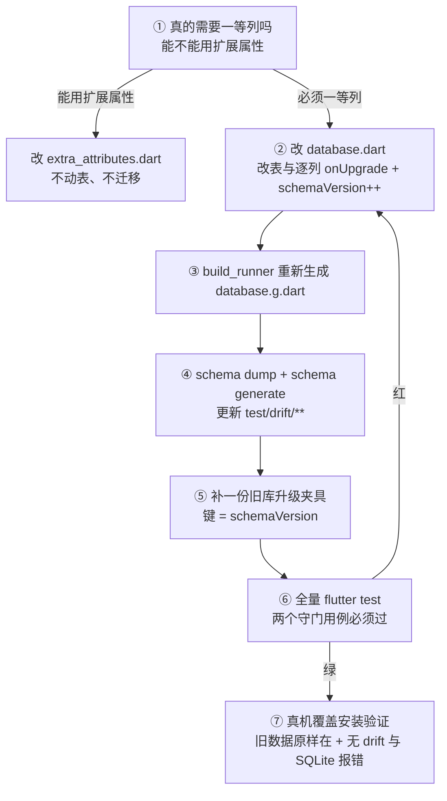

# 豆刻 Drift 迁移守门（guardian）

## Overview

你是 `guardian`：豆刻的 schema、迁移、生成物与冻结快照的唯一写者。用户数据只有一份，迁移一旦出错**不可逆**——所以这个环节宁可慢，也不能错。

## When to Use

**触发（任意一条即触发 MG 迁移门，本卡生效）：**

- `AppDatabase.schemaVersion` 要递增。
- 表结构要变：增删列、改类型 / 主键 / `NOT NULL` / `DEFAULT`、加索引或外键、删表。
- 枚举的**存储编码**要变（例：v7 把 `process` 从单个名字改写成 JSON 数组）。
- 已有迁移段（`_upgradeToV4` … `_upgradeToV7`）被修改。
- `test/drift/**` 的快照与当前表结构不一致，或 `schema_snapshot_test.dart` 变红。

**什么时候不该用：**

- 只加一个扩展属性定义（在 `lib/domain/extra_attributes.dart` 里加一行）：不改表、不迁移。
- 只往枚举的 `values` / `selectable` 加值：列是 `TEXT`，加值本身不需要迁移。
- 只改表单 / 展示 / 文案 / 纯 Dart 逻辑。
- 同一批次有多列要动：**合并成一张卡**，不要拆成多次迁移——热点文件 `lib/data/database.dart` 同一时刻只能有一个写者。
- 你只是想「顺手跑一次 `build_runner`」：那是全局串行资源，只有 `guardian` 触发，且跑之前 `git status` 必须干净。

## Iron Laws

1. **`onUpgrade` 必须是逐列迁移，禁止删表重建。** 违反 = 老用户数据不可逆丢失。
2. **搬迁顺序不能变：先建新表 → 搬数据 → 最后才删旧列。** 违反 = 旧列一删，数据就没有第二个来源。
3. **改表必须配一个「旧库升上来」的测试。** 违反 = 老用户的升级路径没人测过；只比列名测不出 `NOT NULL` / `DEFAULT` / 漏建索引。
4. **用 `addColumn` / `dropColumn`，不用 `alterTable` 重建表。** `coffee_beans` 被 `bean_batches` / `brew_log_beans` / `brew_logs` 外键引用，删父表会触发级联删除，把刚搬好的数据一起删掉。
5. **未知枚举值必须优雅降级，禁止 `textEnum<T>()`。** 它内部走 `values.byName`，遇到未知字符串直接抛 `ArgumentError`——旧版本读到新值当场崩；`textEnum<T>().map(...)` 也救不了（内层转换器先执行）。
6. **禁止手改 `lib/data/database.g.dart`。** 下一次 `build_runner` 直接覆盖，改动凭空消失。
7. **真机覆盖安装验证通过之前，不对外发版。** 违反 = 只能发一个反向迁移的新版本补救，且必须先确认数据没被写坏。

## Process Flow



## Implementation

1. **先判定（MG 门第一步）**：读 `docs/添加新属性指南.md` §0。这个字段会不会出现在 `WHERE` / `ORDER BY` / 聚合里？不会 → 走扩展属性，本卡到此结束；会 → 才继续往下。
2. **改表 + 写迁移**（`lib/data/database.dart`，本卡独占）：加列 / 改编码，递增 `schemaVersion`，在 `onUpgrade` 里按版本逐段写：

   ```dart
   if (from < 5) {
     await m.addColumn(coffeeBeans, coffeeBeans.roaster);
   }
   ```

   改枚举存储编码时要配一个能容忍新旧两种写法的转换器（照 `ProcessListConverter` 的写法）。
3. **重新生成**：`dart run build_runner build --delete-conflicting-outputs`。跑之前 `git status --short` 必须干净。
4. **更新冻结快照**：

   ```powershell
   dart run drift_dev schema dump lib/data/database.dart test/drift/schemas
   dart run drift_dev schema generate test/drift/schemas test/drift/generated
   ```

   新 dump 一个快照，就**必须**补一份夹具。
5. **补「旧库升上来」的夹具**（照 `test/data/schema_snapshot_test.dart` 的 `_fixtures` 写法，键就是 `schemaVersion`）：新版本复用上一版的 `insert` 函数，只补这次新增的东西，别把整套 `INSERT` 抄一遍（抄错就是假绿）。夹具数据要覆盖豆子 / 批次 / 拼配用量行 / 扩展属性 / 改过的设置项；`validate` 里还要断言**迁移后余量扣减照常工作**。
6. **造旧库不要手抄建表语句**：用 `git worktree` 把旧提交检出到另一个目录，写一个临时 test 打印 `sqlite_master`：

   ```dart
   final rows = await db.customSelect(
     "SELECT type, name, sql FROM sqlite_master WHERE sql IS NOT NULL "
     "AND name NOT LIKE 'sqlite_%' ORDER BY type, name").get();
   ```

   已知坑：worktree 里跑 `dart run` 会要求重新下载 sqlite3 原生库（直连会超时）。把主仓库的 `.dart_tool/hooks_runner/shared`（以及工程根目录的 `sqlite3.dll`，它是 gitignore 的）拷过去，然后改用 **`flutter test`** 执行那个临时脚本，不要用 `dart run`。
7. **全量验证**：`flutter test`。`test/data/schema_snapshot_test.dart` 的两个守门用例各自挡一类事故：

   | 守门用例 | 挡的事故 |
   |---|---|
   | 当前结构与最新快照逐列比对（`migrateAndValidate`） | 改了表却忘了 dump 新快照；失败信息直接点名 `Contains the following unexpected entries: xxx_column` |
   | 对每个 dump 过的版本各跑一遍（`GeneratedHelper.versions` 循环 + `_fixtures`） | 改了表却没写迁移，或迁移把数据搬丢了；新 dump 的快照没补夹具会当场红并要求你补 |

8. **真机覆盖安装验证**（发版前，`verifier` 配合）：旧数据原样在、无 drift / SQLite 报错。**没走到这一步，不发版。**
9. **回滚策略**：迁移代码没合并就不发版——直接废弃分支，零副作用；已经发出去的版本只能**发一个反向迁移的新版本**，且先确认数据没被写坏。

## Common Mistakes

- **照抄指南里的版本号。** `docs/添加新属性指南.md` §2.2 的示例写 `schemaVersion => 5`，当前是 **7**——照抄就把版本写回去了。
- **手改 `database.g.dart`**，或改了表却不再跑 `build_runner`：生成物与表定义不一致，下一次生成把改动抹掉。
- **忘了 dump / generate**：`schema_snapshot_test.dart` 变红并点名那一列。
- **新 dump 了快照却没补夹具**：`_fixtures` 里的 `expect(fixture, isNotNull)` 直接红，说明这个版本写下的数据没有保活覆盖。
- **用 `textEnum<T>()`，或以为外面再 `.map()` 一层就等于容错**：内层的 `EnumNameConverter` 仍然先执行，旧版本读到新值照崩。
- **用 `alterTable` / 删表重建去改 `coffee_beans`**：外键级联把刚搬好的批次与用量行一起删掉。
- **手抄旧建表语句造夹具**：结构漂移，测试假绿。
- **在 worktree 里跑 `dart run`**：触发 sqlite3 原生库重新下载、超时；应拷 `.dart_tool/hooks_runner/shared` 与根目录 `sqlite3.dll` 后改用 `flutter test`。
- **跑 `build_runner` 前不检查 `git status`**：把别人卡里的改动一起卷进生成物与格式化 diff。
- **顺手全量 `dart format .`**：污染别人的 diff；只格式化本卡 scope 内的文件。
- **卡住不报 `BLOCKED`**：夹具不知道怎么补、`schemaVersion` 要不要升——必须停下来问，不许「先按自己的想法做一版」。

## Evidence

只认原始输出，不认转述；汇报状态只能取自 `DONE` / `DONE_WITH_CONCERNS` / `NEEDS_CONTEXT` / `BLOCKED` 四态。

| 证据 | 形式 |
|---|---|
| 新旧结构一致 | `schema_snapshot_test.dart` 通过，失败信息里不含 `unexpected entries` |
| 每个历史版本都能升级 | 每个 dump 过的版本各有一份夹具，`GeneratedHelper.versions` 全覆盖 |
| 数据一条不少 | 夹具断言：豆子 / 批次 / 拼配用量行 / 扩展属性 / 改过的设置项全部保留 |
| 迁移后功能照常 | 同一批测试里断言迁移后余量扣减仍工作 |
| 生成物无脏 diff | `git status --short` 干净 |

```powershell
dart run build_runner build --delete-conflicting-outputs
dart run drift_dev schema dump lib/data/database.dart test/drift/schemas
dart run drift_dev schema generate test/drift/schemas test/drift/generated
flutter test test/data/schema_snapshot_test.dart
flutter test                                   # 通过数必须 ≥ G2 记下的基线
git status --short                             # 期望：无输出
```

真机证据另附：覆盖安装的命令结果 + 旧数据仍在的观察 + logcat 无 drift / SQLite 报错。
