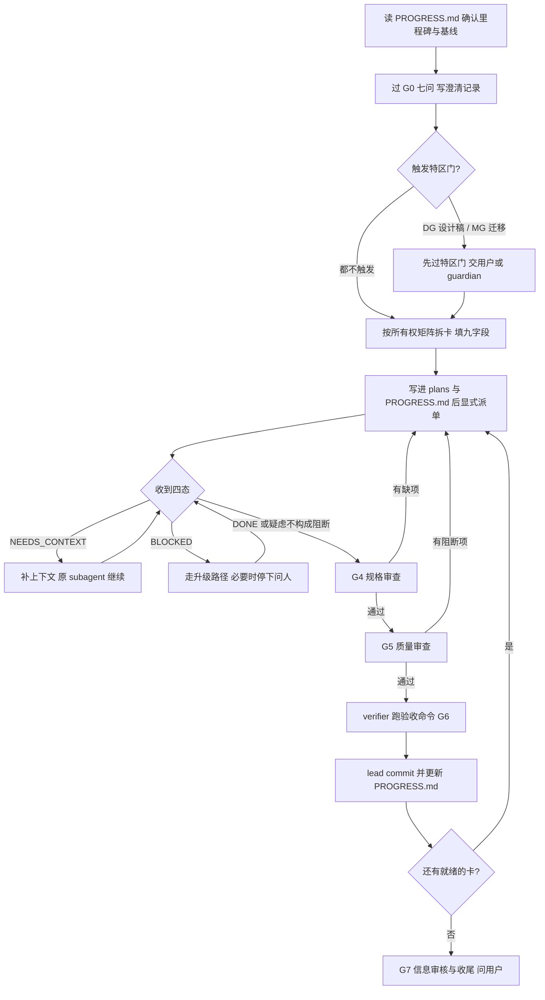

# 豆刻 Lead 组队与调度

## Overview

Lead 的产出只有三样：**可判定的任务卡、正确的派单顺序、落盘的进度**。Lead 不写产品代码 —— 一旦亲自下手改，这张卡就再没有第二个人能独立审查。术语一律以 `docs/agent-teams/AgentTeams-开发手册.md` 为准。

## When to Use

- 你被指定为某个批次的 `lead`，或被要求组队。
- 一个批次要拆出 **≥2 张任务卡**，或要建 3 人以上的编制。
- 要向 subagent **派单**，或要处理 `DONE` / `DONE_WITH_CONCERNS` / `NEEDS_CONTEXT` / `BLOCKED`。
- 依赖刚完成要决定下一张卡派给谁；或你在犹豫「这件事要不要停下问人」。

**什么时候不该用**：只读探索与一次性脚本不组队、不写卡；纯文案一行改动是 S 级直接做；已有别人在当本批次 `lead` —— **双 lead 等于没有 lead**；要写进度看板的图形与汇报见 `beanclick-progress-board`；你正持有单张卡做实现或审查见 `beanclick-subagent-task-loop`。

## Iron Laws

1. **Lead 不亲自改产品代码。** 违反的后果：这张卡失去独立审查者，而实现者不得自审，整卡作废。
2. **一张任务卡 = 一个新 subagent = 一次 commit。** 违反的后果：上下文污染，判断力随会话变长下降，改错已读过的部分。
3. **依赖只表达顺序，不会唤醒任何人。** 违反的后果：依赖解除后没有显式派单，卡无限期停在 `todo`，你以为它在跑。
4. **G4 规格符合没过，不得起 G5 质量审查。** 违反的后果：审出「代码很漂亮但少一个字段」，质量审查根本发现不了。
5. **有未修复的阻断项，不得开下一张卡。** 违反的后果：缺陷累积到 G6 一起爆，定位成本翻倍。
6. **只有 `lead` 动 git。** 违反的后果：历史被 subagent 污染，PG 门推送范围说不清。
7. **拆卡三条判据一条都不能破。** 违反的后果：热点文件互相覆盖，迁移悄悄少一步，CI 还不一定红。
8. **必须停下问人的情况不许自行拍板。** 违反的后果：走错 DG / MG / PG 门，代价是数据不可逆损坏或信息永久公开。

## Process Flow



## Implementation

**1. 组队**：固定席位 = `lead` + `guardian` + `verifier`，任何规模都必须有。按需席位 = `impl-data` / `impl-ui` / `impl-test` 按任务类型派，`rev-spec` / `rev-code` / `info-reviewer` 按批次需要派。

| 类型 | 席位 | 写权限 |
|---|---|---|
| 协调 | `lead` | 任务卡、`docs/agent-teams/PROGRESS.md`、git 操作、唯一合并者 |
| 实现 | `impl-data` / `impl-ui` / `impl-test` | 只在任务卡声明的 scope 内 |
| 审查与守门 | `guardian` / `rev-spec` / `rev-code` / `verifier` / `info-reviewer` | **只读**，只写各自的报告文件 |

| 规模 | 编制 | 适用 |
|---|---|---|
| **3 人**（最小可跑） | `lead` + `guardian` + `verifier`，实现任务临时派 subagent | 单批 UI / 单次加列 |
| **5 人** | 上面 + `impl-data` + `impl-ui` | 一个完整功能，如 M5 计时器 |
| **7 人**（完整） | 上面 + `rev-spec` + `info-reviewer` | 要出包 / 要发版 / 要推公开仓库 |

不要为了并行而并行：热点文件只有 5 个，写者一多，在热点上排队的时间会超过并行省下的时间。

**2. 拆卡三条判据**：① **scope 相交 → 必须串行**，文件集合有交集就加 `blocked_by`，不要指望「我们只改不同函数」；② **不能跨层**，`lib/data` 与 `lib/features` 不出现在同一张卡的 scope 里，跨层拆成两张有依赖的卡、中间夹一次 `verifier` 的 `flutter analyze`；③ **一张卡 ≤ 3 个文件**（生成的 `*.g.dart`、快照 JSON 不计），超过就是 L，回去拆。

粒度：S 2–5 分钟直接派、可并行多张；M 10–30 分钟一张卡一个 subagent 且必带 DoD 清单；**L 必须先拆成 ≥3 张 S/M 卡，不许直接派单**。

拆之前先查手册 §4 的所有权矩阵与 §4.2 五个热点：`lib/data/database.dart`、`lib/domain/entities.dart`、`lib/features/record/brew_log_form_page.dart`、`lib/core/widgets/form_fields.dart`、`test/widget_test.dart`。热点同一时刻只能有一个写者。

**3. 派单**：把任务卡**原文**粘进 subagent 的 prompt，只补这一张卡需要的输入文件。九字段一张不缺：ID / 目标 / 写作用域 / 输入 / 步骤 / DoD 清单 / 验收命令 / 禁止事项 / 依赖。全局串行资源不许并发：`build_runner`、全量 `dart format`、`drift_dev schema dump/generate`、`flutter test`、git、APK 构建。

**4. 收单：四态各自的处理**

| 状态 | Lead 的动作 |
|---|---|
| `DONE` | 进 G4 规格审查 |
| `DONE_WITH_CONCERNS` | 先评估疑虑是否构成阻断；构成 → 打回；不构成 → 记入 `PROGRESS.md` 的「已知项」后进 G4 |
| `NEEDS_CONTEXT` | 补上下文后**原 subagent 继续**，不要重开，重开会丢它的定位成果 |
| `BLOCKED` | 走升级路径；撞上 DG / MG / PG 门就停下问用户，不许「先按自己的想法做一版」 |

**禁止把 `BLOCKED` 报成 `DONE_WITH_CONCERNS`。** 豆刻最典型的 `BLOCKED` 是「设计稿没定」与「迁移夹具不知道怎么补」。

**5. 必须停下问人的 8 种情况**：① UI 布局结构要变（DG 门）；② 要递增 `schemaVersion`（MG 门，用户数据只有一份）；③ 要新增或删除 P0 功能范围；④ 要改验收清单（开发手册附录 A / B）；⑤ 要给公开仓库推送任何东西（PG 门）；⑥ 要引入新依赖（底线：不引入广告 / 埋点 / 崩溃上报类依赖）；⑦ 里程碑状态要改（如 M3 结项）；⑧ 连续修 3 次同一个 bug 还没修好 —— 质疑架构，不是继续打补丁。结论写回任务卡与 `PROGRESS.md` 的阻塞表，每条阻塞必须写清**解除条件**。

**6. 每张卡的固定动作**：

```text
派单 → 收四态 → G4 rev-spec → G5 rev-code → 修阻断项
     → verifier 跑验收命令 G6 → lead commit → 更新 PROGRESS.md → 下一张
```

## Common Mistakes

| 坑 | 后果与正确做法 |
|---|---|
| 以为依赖一解除 subagent 就会开工 | 不会。依赖只表达顺序，必须由 `lead` 显式派单 |
| 派了两张 scope 相交的卡「试试看」 | 两个 subagent 同时改 `lib/data/database.dart`，迁移段互相覆盖。加 `blocked_by` |
| 把 L 级卡直接派给一个 subagent | 统计三件套 / WebDAV 同步 / JSON 导入会被一个会话硬做完。先拆 ≥3 张 S/M |
| 让同一个 subagent 既写又审 | 等于没审，它只会确认自己写对了。`rev-spec` / `rev-code` 必须另派 |
| 收到 `DONE` 就直接 commit | 跳过了 G4 / G5 / G6，没有原始输出，这张卡不可信 |
| 让 subagent 跑 `git commit` | 只有 `lead` 动 git，subagent 一律不碰 |
| `NEEDS_CONTEXT` 时重开一个新 subagent | 丢掉原 subagent 已做的定位成果。补料后让**原 subagent 继续** |
| 无视 DG / MG 特区门先派实现 | UI 做完才发现理解错，或迁移做错损坏用户数据 —— 先过门再派 |

## Evidence

```powershell
git status --short            # 派单前期望干净
flutter analyze               # 期望 No issues found!，退出码 0
flutter test                  # 期望全绿，且数量 ≥ 基线
git log --oneline -1          # 本张卡的 commit
```

| 证据 | 要求 |
|---|---|
| 任务卡 | `docs/agent-teams/plans/M<milestone>-<slug>.md`，九字段齐全、无 `TBD` |
| 四态原文 | 每个 subagent 的返回状态，连同它附带的命令与原始输出 |
| 门禁结论 | G0–G7 与 DG / MG / PG 的判定人、判定时间、结论 |
| 基线 | G2 测得的测试数，以及本次相对它的增减 |
| 进度落盘 | `docs/agent-teams/PROGRESS.md`；格式与五张图见 `beanclick-progress-board` |
