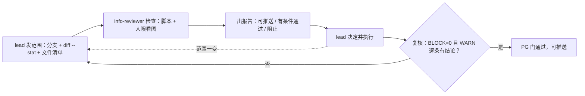

# 豆刻推送前信息审核（PG 门）

## Overview

豆刻仓库是**公开**的，推上去就是永久公开。任何 `git push` / 建 PR / 发 Release 之前，
由只读的 `info-reviewer` 出报告，`lead` 决定并执行；审核员**不碰 git**，
完整口径见 [`REVIEW-BEFORE-PUSH.md`](../../../REVIEW-BEFORE-PUSH.md)。

## When to Use

- 任何一次 `git push` / 建 PR / 发 Release / 打 tag / 上传构建产物之前。
- `lead` 刚发来审核范围（分支名 + `git diff --stat` + 文件清单）时。
- 上一轮审核之后**范围又变了** —— 哪怕只是多传一张图，也回到第 1 步重审。
- 需要复核：改动落地后确认 `BLOCK=0` 且 WARN 逐条有结论时。

**什么时候不该用**

- 本轮不改任何会被推送的内容（纯本地实验、未落盘的探索）。
- 想让审核员顺手执行 `git add` / `commit` / `push` —— 那是 `lead` 的独占动作，不在本卡范围。
- 只想知道某段代码好不好看 —— 那是 `rev-code` 的代码质量审查（见 `beanclick-two-stage-review`），不是信息审核。

## Iron Laws

1. **不得代替 `lead` 执行任何 git 操作**（`add` / `commit` / `push` / `tag` / `filter-repo`），
   也不改产品代码。后果：审核人兼执行人，「谁审的」这句话当场失效。
2. **不得用 `upload-safety:ignore` 掩盖真实值。** 该标记只允许出现在「文档必须展示原始模式」的行上。后果：真实凭据漏进公开仓库。
3. **「本机信息」列不许写「无」了事。** 要么确认无，要么写清命中什么。后果：没有结论的 WARN 视为未审核。
4. **凭据类一律阻断**，哪怕「看起来是占位符」——先当真实值查证，再降级。后果：密钥视为已泄露，只能轮换。
5. **范围一变就作废重审。** 「就多传一张图」是信息泄露最常见的入口。
6. **脚本过了不等于审过了。** 图片内容、语义判断、git 历史都是脚本盲区，必须人工补。
7. **复核没通过不推。** `BLOCK=0` 且 WARN 逐条有结论，才算审完。

## Process Flow



## Implementation

**五步流程，缺一步不算审完**

| 步 | 谁 | 做什么 |
|---|---|---|
| 1 | `lead` | 发范围：分支名 / `git diff --stat` / 「我要提交这些文件」，必须具体到文件 |
| 2 | `info-reviewer` | 跑 `tool/check_upload_safety.ps1` + 补脚本查不到的人工项（图片内容） |
| 3 | `info-reviewer` | 出报告：三选一结论 + 逐文件五列表 + 每条的具体改法 |
| 4 | `lead` | 采纳 / 部分采纳 / 记录风险后照推；由 `lead` 执行 git |
| 5 | `info-reviewer` | 复核：重跑脚本，确认 `BLOCK=0`、WARN 已逐条有结论 |

**脚本用法与退出码**

```powershell
powershell -NoProfile -ExecutionPolicy Bypass -File .\tool\check_upload_safety.ps1 -All
# 退出码 0 = 无阻断项；1 = 有阻断项（不要推）；2 = 脚本自身跑不起来
```

**严重度三档**（判定口径见 `REVIEW-BEFORE-PUSH.md` §2）

| 级别 | 含义 | 典型触发 | 处理 |
|---|---|---|---|
| 阻断 BLOCK | 一旦公开即造成不可逆损失 | 私钥 / 密钥库 / `key.properties` / 真实口令 / token；个人目录路径（`<盘符>:\Users\<本机用户名>`）；`build/`、`dist/`、`.dart_tool/` 被 track | 修完再推，没有例外 |
| 警告 WARN | 不该公开或需要说明 | 其它因机器而异的绝对路径、设备型号 / 序列号、内网 IP（`<内网网段>`）与本机端口（`<本机代理端口>`）、`<私人邮箱>`、可一条命令重生成的预览产物、大于 512KB 的二进制、真实个人数据 | 逐条给结论：改掉 / 明确记录「为什么可以留」 |
| 提示 INFO | 有意约定或观察项 | 文档里写明的项目工具链路径、生成源码 `*.g.dart`、golden 基线 | 知悉即可，不必逐条处理 |

**机器路径看在哪个文件里**：`docs/*.md` 里且是有意写明的项目约定 → 提示（仍建议泛化）；
出现在 `lib/`、`test/`、`tool/*.ps1`、`tool/**/*.dart` 里 → **警告**，
因为这是「本机环境写死进代码」，换台机器就跑不通。

**审核三类**

| 类 | 判据 | 结论档 |
|---|---|---|
| A 必要性 | 别人要开发 / 构建 / 理解这个项目，是否必需这个文件？ | 必需保留 / 默认排除 / 留档例外（必须写理由 + 回答「别人能不能一条命令重生成」） |
| B 本机信息 | 有没有把本机路径、设备、凭据、代理端口、邮箱、真实个人数据带上去？ | 无 / 提示 / 警告 / 阻断 + 具体是什么 |
| C 硬编码 | 这处硬编码是稳定的，还是因机器而异？ | 合理 / 建议提取 / 必须外置 |

**脚本盲区必须人工补**

- **图片内容**：用 `git ls-files` 列出范围内的 `*.png` / `*.jpg` / `*.webp`，逐张打开看
  （桌面壁纸、状态栏、天气与定位城市、步数、通知内容、聊天截图、真实姓名头像）。
  程序渲染的 golden / 预览图仍要抽查，确认不是真实设备截图、不是真实个人记录。
- **语义判断**：一段文字是不是真实个人数据；某条绝对路径算不算「有意约定」。
- **git 历史**：脚本只看当前 worktree 与 index；查历史用只读命令
  （`git rev-list --all --objects` + `git cat-file`），判定密钥是否进过历史不能只看当前文件。

## Common Mistakes

| 坑 | 后果 | 正确做法 |
|---|---|---|
| 范围变了不回第 1 步 | 「就多传一张图」是最常见的泄露入口 | 范围一变就作废重审 |
| 用 `upload-safety:ignore` 压掉真实路径 | 审核形同虚设 | 只用于文档必须展示原始模式的场合 |
| 「本机信息」列写「无」 | 没有结论的 WARN 视为未审核 | 逐条写清命中什么，或写明确认无 |
| 审核员顺手 `git add` | 执行人兼审核人，无法追责 | 只出报告；git 只由 `lead` 动 |
| 脚本退出码 0 就宣布通过 | 脚本不看图片内容与 git 历史 | 补齐人工项再给结论 |
| 结论写「基本没问题」 | 收到的人无法判断要不要停 | 只能用 可推送 / 有条件通过 / 阻止 |
| 小体积图片默认放过 | 泄露与图片大小无关 | 范围内每张新增 / 修改的图都要看 |

## Evidence

报告里必须交出（骨架见 [`审查报告模板.md`](../../审查报告模板.md) 第 3 份）：

- 脚本原始输出摘要：`BLOCK=<n> WARN=<n> INFO=<n>`（退出码 `<n>`）+ 扫描范围与文件数。
- 逐文件五列表：`文件 | 必要性 | 本机信息 | 硬编码 | 结论`，每行指名 `<路径>:<行号>`。
- 图片清单：每张图的用途 + 「已确认无个人信息」或「需要 `lead` 人眼确认」。
- 三选一结论：可推送 / 有条件通过 / 阻止；阻止时列出阻断项与具体改法。
- 复核记录：改动落地后重跑脚本的计数与退出码。
