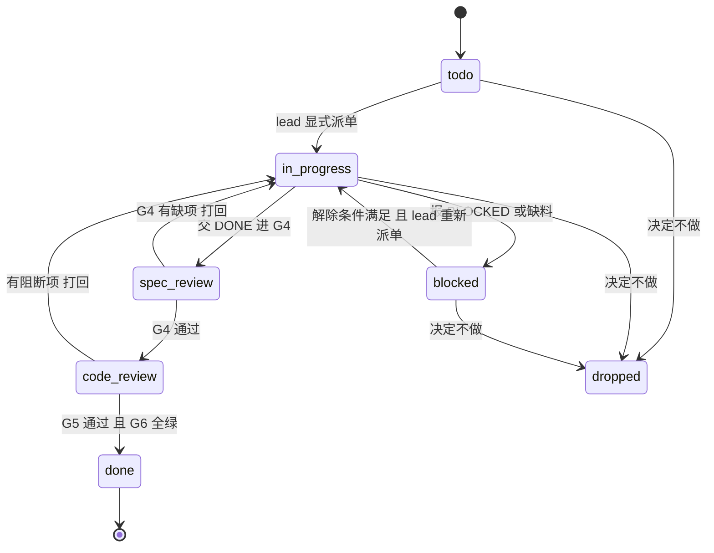

# 豆刻进度看板

## Overview

`docs/agent-teams/PROGRESS.md` 是**唯一真相源**，只有 `lead` 能写。任何不在这份文件里的「进度」都等于不存在；这份看板的读者是**人**，不是代理。

## When to Use

- 用户问「现在到哪了 / 卡在哪 / 下一步是什么」。
- 每张卡**状态迁移**：claim / 完成 / 打回 / 阻塞。
- 每个**门禁**通过或失败：G0–G7 / DG / MG / PG。
- 出现或解除**阻塞**；每天**收工**；迭代**收尾**。

**什么时候不该用**：组队、拆卡、派单见 `beanclick-lead-orchestration`；单张卡的 TDD 与两阶段审查见 `beanclick-subagent-task-loop`；想用聊天消息代替落盘不成 —— **聊天汇报不算进度**，先写 `PROGRESS.md` 再汇报；想自造状态名或换图形语法也不成，口径已定，改动它等于让历史图不可读。

## Iron Laws

1. **`PROGRESS.md` 是唯一真相源，只有 `lead` 能写。** 违反的后果：subagent 直接改写真相源，两份进度互相矛盾，图失去意义。
2. **状态词只能用七个：`todo` / `in_progress` / `spec_review` / `code_review` / `blocked` / `done` / `dropped`。** 违反的后果：出现「差不多完成了」这类词，图不可判定，等于没有进度。
3. **两步审查必须分成两个状态。** 违反的后果：`spec_review` 与 `code_review` 合并成一个，看不出卡在哪一道门。
4. **汇报「测试全过」必须附命令 + 通过数 + 退出码。** 违反的后果：没有基线，无从判断退化，这句汇报在豆刻无效。
5. **每条阻塞必须写清解除条件与负责人。** 违反的后果：阻塞无主，没人知道它什么时候能解除。
6. **门禁图在门禁通过或失败的当次更新。** 违反的后果：用户看到的是过期结论，据此做错决定。
7. **只用五种 mermaid 语法：`flowchart` / `stateDiagram-v2` / `sequenceDiagram` / `gantt` / `pie`。** 违反的后果：GitHub 渲染不出来，图裂等于没有进度。
8. **颜色固定：`todo` 灰、`in_progress` 蓝、两步审查琥珀、`blocked` 红、`done` 绿、`dropped` 深灰。** 违反的后果：同一颜色在不同图里含义不同，看板失去「一眼可扫读」。

## Process Flow



## Implementation

**1. 五个必须刷新的时机**

| 时机 | 刷新什么 |
|---|---|
| 每张卡**状态迁移** | 任务状态机 + 任务 DAG 的节点状态 |
| 每个**门禁**通过或失败 | 门禁健康度图 |
| 出现或解除**阻塞** | 阻塞表 + DAG 上的红色边 |
| **每天收工** | 里程碑总览 + 测试数 / 包体趋势 |
| 迭代**收尾** | 全图刷新 + 归档到 `docs/agent-teams/plans/` |

**2. 五张标准图**（母版在 `docs/agent-teams/Mermaid-图集.md`，复制即用）

| # | 图 | 回答的问题 | 建议语法 |
|---|---|---|---|
| 1 | 里程碑总览 | 我们现在在 M 几？ | `flowchart` 或 `gantt` |
| 2 | 任务 DAG | 这批要做几张卡、谁挡着谁？ | `flowchart` |
| 3 | 任务状态机 | 单张卡走到哪一步了？ | `stateDiagram-v2` |
| 4 | 迭代泳道 | 谁在干什么、并行度如何？ | `flowchart` + `subgraph` |
| 5 | 门禁与健康度 | 有哪些门没过，测试数 / 包体有没有退化？ | `flowchart` 或 `pie` |

画图规矩：节点 id 用 ASCII，标签一律加英文双引号，标签里不出现未转义的 `()` 或 `[]`、也不写 `#`；着色只用 `classDef` / `class`，只用上面列出的五种语法。细则见 `docs/agent-teams/Mermaid-图集.md` §0。写进图里的当前事实：0.2.0 = M0–M2.11，schema v7；实测基线见 `docs/agent-teams/PROGRESS.md`（2026-10-01：`flutter test` 299 通过），README 的 297 与 `docs/DEVELOPMENT.md` §11 的 292 已过期，**以实跑为准**。里程碑：M3 = Android 内测，M4 已降级为可选，M5 = P1 计时器 / 统计 / 图片分享 / 同步，M6 = P2。

**3. 聊天汇报格式**：不超过 10 行 + 一张缩略图，必须带测试数与退出码。

```text
M3-T04 规格审查通过 → 进入质量审查
门禁：G4 ✅ | G5 进行中 | 测试 <基线 n> → <当前 n+Δ>（+Δ，退出码 0）
阻塞：无
下一动作：rev-code 审 impl-ui 的记录页左滑改动
```

**4. 状态词表与颜色**

| 状态 | 含义 | 颜色 |
|---|---|---|
| `todo` | 未开工 | 灰 |
| `in_progress` | 实现中 | 蓝 |
| `spec_review` | 等待 G4 规格符合审查 | 琥珀 |
| `code_review` | 等待 G5 质量审查 | 琥珀 |
| `blocked` | 撞上无法自行解决的事，已登记解除条件 | 红 |
| `done` | 已过门禁并落盘 | 绿 |
| `dropped` | 决定不做 | 深灰 |

## Common Mistakes

| 坑 | 后果与正确做法 |
|---|---|
| 只在聊天里说进度，不写 `PROGRESS.md` | 不在这份文件里的进度等于不存在。先落盘，再汇报 |
| 让 subagent 直接写 `PROGRESS.md` | 只有 `lead` 能写唯一真相源；subagent 汇报，`lead` 落盘 |
| 用「差不多完成了」「基本通过」 | 图里出现的词必须来自七词表，否则图不可读 |
| 汇报「测试全过」不带数字 | 附命令 + 通过数 + 退出码；退化即 G6 不过 |
| 门禁变化攒到收工再更新 | 门禁图必须当次更新，否则用户看到的是过期结论 |
| 阻塞只写「卡住了」 | 必须写解除条件与负责人，否则阻塞无主、无人能解 |
| 把 `spec_review` 与 `code_review` 合成一个状态 | 两步审查是两种琥珀、两个状态；合并就看不出卡在哪道门 |
| 忘记 `dropped` | 决定不做的卡不标 `dropped`，DAG 上会永远留一个假的未完成节点 |
| 用五种之外的图表类型 | GitHub 不保证支持，图裂等于没有进度。只用 `flowchart` / `stateDiagram-v2` / `sequenceDiagram` / `gantt` / `pie` |
| 用中文做节点 id、标签不加引号 | 渲染报错或图裂。节点 id 用 ASCII，标签加英文双引号 |

## Evidence

`lead` 每次刷新进度必须交出的证据：

```powershell
git status --short                      # 期望干净；有改动要写明归属
git log --oneline -5                    # 与「一张卡一次 commit」对得上
flutter test                            # 汇报里测试数与退出码的出处
powershell -NoProfile -ExecutionPolicy Bypass -File .\tool\check_upload_safety.ps1 -All -SummaryOnly
```

| 证据 | 要求 |
|---|---|
| `docs/agent-teams/PROGRESS.md` | 五张图都反映当前真实状态，收工时**不欠账** |
| 状态词表 | 全文只用七个词，无近义词、无自造词 |
| 测试数 | 相对 G2 基线的增减，附命令与退出码 |
| 阻塞表 | 每条都有解除条件与负责人 |
| 门禁记录 | G0–G7 / DG / MG / PG 的结论、判定人、判定时间 |

> 基线以**实跑**为准：`docs/agent-teams/PROGRESS.md` 记的 2026-10-01 实测是 299 通过；README 的 297 与 `docs/DEVELOPMENT.md` §11 的 292 都已过期，不要在汇报里引用。
