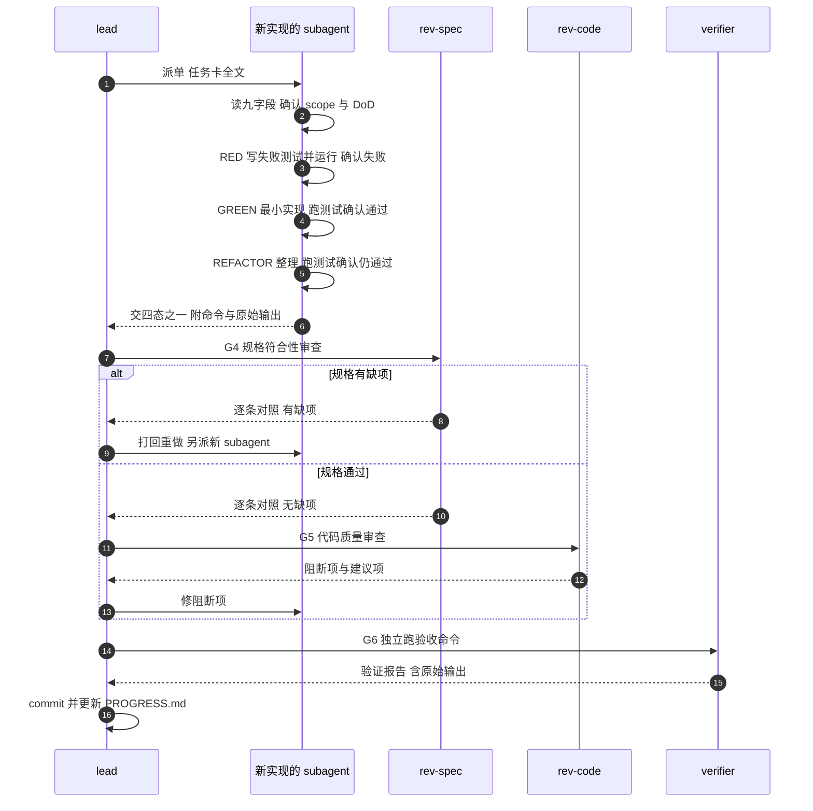

# 豆刻子代理任务闭环

## Overview

一张任务卡 → 一个新 subagent → 两阶段审查 → `lead` commit，就是这个闭环的全部。**RED 必须先失败，实现者不得自审，G4 没过不起 G5。**

## When to Use

- 你被派到**一张**任务卡（`M<milestone>-T<nn>`），要做完并交证据。
- 你被派为 `rev-spec` / `rev-code` / `verifier`，要为某张卡出结论。
- 你是 `lead`，要按固定动作收单、过门禁、commit 单张卡。
- 卡卡住了，你要判断该报 `NEEDS_CONTEXT` 还是 `BLOCKED`。

**什么时候不该用**：只读探索或一行文案改动不构成一张卡；卡是 L 级就先回去拆成 ≥3 张 S/M 卡再套本流程；组队、拆卡、跨卡调度见 `beanclick-lead-orchestration`；更新进度看板见 `beanclick-progress-board`。

## Iron Laws

1. **RED 必须先失败并真的运行过。** 违反的后果：没跑过失败测试就写实现，等于不知道测试测的是什么，该实现作废重来。
2. **实现者不得自审。** 违反的后果：自己给自己出的结论等于没审，只会确认自己「写对了」。
3. **G4 规格符合未过，不得起 G5 质量审查。** 违反的后果：审出「代码很漂亮但少一个字段」。
4. **每张卡必须用新 subagent。** 违反的后果：上下文污染，判断力下降并改错已读过的部分。
5. **L 级不许直接派单。** 违反的后果：一个会话硬做完整个功能，这正是热点文件失控的起点。
6. **TDD 三段一步不能少：RED → GREEN → REFACTOR，每段都跑测试。** 违反的后果：测试与实现脱节，改坏了没人知道。
7. **subagent 一律不碰 git，commit 由 `lead` 执行。** 违反的后果：历史被污染，PG 门范围说不清。
8. **交证据必须是原始输出。** 违反的后果：「我跑过了」在豆刻不是证据，无法判断是否退化。

## Process Flow



## Implementation

**1. 读任务卡的九个字段**：缺字段或含 `TBD` → 立即报 `NEEDS_CONTEXT`，不要猜。

| # | 字段 | 你要读出什么 |
|---|---|---|
| 1 | ID | `M<milestone>-T<nn>`；commit message 与看板都用它 |
| 2 | 目标 | 一句话、可判定；这是 G4 逐条对照的**唯一**依据 |
| 3 | 写作用域 | **文件级**清单；只准写清单里的文件，多一个就是越权 |
| 4 | 输入 | 只读本卡需要的文件与设计稿；缺了就报 `NEEDS_CONTEXT` |
| 5 | 步骤 | 顺序化，含 RED / GREEN / REFACTOR 三段 |
| 6 | DoD 清单 | 逐条勾选；最容易漏的是「6 个地方」里没被点名的那一处 |
| 7 | 验收命令 | 可直接粘贴执行，命令与**期望输出**要一起看 |
| 8 | 禁止事项 | 本卡红线：不碰 git / 不改生成物 / 不跑全量 `dart format` |
| 9 | 依赖 | `blocked_by` / `blocks`；依赖只表达顺序，**不会唤醒你**，由 `lead` 派单 |

**2. TDD 三段落地**：**RED** 先写会失败的测试并**运行**，亲眼确认失败（不是「应该会失败」）——领域、编码、真实落盘放普通 `test`（如 `test/domain/export_encoder_test.dart`），表单、列表、导航放 `testWidgets` 并用 `harness.finish(tester)` 收尾、**不要** `await db.close()`；**GREEN** 写刚好让测试通过的最小实现，不夹带重构、不夹带额外功能；**REFACTOR** 消除重复、改善命名，保持测试全绿。每段各跑一次测试，`flutter test` 是全局串行资源，一张卡一次、不要并发跑多个实例。

**3. 写测试时的豆刻红线**：

- widget 测试里 `await db.close()` 会因流查询未归零而**永久阻塞** → 用 `test/helpers/widget_harness.dart` 的 `harness.finish(tester)`，只拆树。
- `scrollUntilVisible` **只朝一个方向滚**，目标在上方永远滚不到并抛 `Bad state: No element` → 用 harness 扩展 `fillField` / `tapKey` / `tapTextScrolled`。
- 在 `testWidgets` 里断言文件真的写出去了 → fake-async 下回调不会来，测试能过但文件没写 → 编码与落盘放普通 `test`。
- 只断言 `log.doseGrams` 不断言批次余量 → 真实发生过「改了粉量、余量一分没动、测试全绿」→ UI 保存后顺手断言批次。
- 覆盖项只在业务 `setUp` 里登记 → 静默失效 → 用 harness 的 `useOverrides()`，它会立刻重建容器。
- 夹具里写 `CoffeeBean(remainingGrams: ...)` → v4 起余量在**批次**上，该参数已不存在 → 用 `harness.addBeanWithBatch(...)`。

**4. 两道审查、一道验证**：`rev-spec` 判 G4，逐条对目标与 DoD、**无缺项**，不过就打回重做并由 `lead` 另派 subagent；`rev-code` 判 G5，看是否有阻断项、`flutter analyze` 是否 0 问题、本卡测试是否绿，不过就修阻断项再重审；`verifier` 判 G6，独立跑 `dart format --output=none --set-exit-if-changed .`、`flutter analyze`、`flutter test`，全绿且测试数 ≥ 基线，红就打回 G3 重新拆卡。**审查者只写报告，不实现、不代改**；实现者也不得给自己出结论。

**5. 交证据与 commit**：四态回给 `lead`，由 `lead` 执行 commit 并更新 `docs/agent-teams/PROGRESS.md`。commit message 走约定式提交，类型取 `feat` / `fix` / `docs` / `style` / `refactor` / `test` / `chore`，例 `feat(record): 支持复制上次冲煮参数`。

## Common Mistakes

| 坑 | 后果与正确做法 |
|---|---|
| 先写实现再补测试 | 后补的测试验证的是「你写了什么」，不是「你需要什么」。RED 必须先失败 |
| 「这个太简单不需要测试」 | 简单的东西测试也简单。没跑过失败测试就没有 GREEN |
| 手动测过就算过 | 手动不可复现，下次改动没人保证。必须落成测试 |
| 测试难写就绕开 | 测试难写说明设计有问题，该简化接口，而不是降低断言 |
| 自己给自己做审查结论 | 等于没审。G4 / G5 另派 `rev-spec` / `rev-code` |
| G4 没过先起 G5 | 会得到「代码很漂亮但少一个字段」，质量审查发现不了 |
| 复用上一个任务的会话 | 上下文污染。每张卡新开 subagent |
| 跨层改 `lib/data` 与 `lib/features` | 加一个一等列要改 6 处，豆刻最容易漏映射。跨层拆两张有依赖的卡 |
| 手改 `lib/data/database.g.dart` | 下次 `build_runner` 直接覆盖；schema 与迁移属 MG 门、`guardian` 独占 |
| 用 `textEnum<T>()` 加枚举值 | 旧版本读到新值直接抛 `ArgumentError` 崩溃。用裸 `text()` + 容错转换器 |
| 卡住时硬做一版 | 该报 `BLOCKED` 就报。最典型的是「设计稿没定」与「迁移夹具不会补」 |

## Evidence

```powershell
# 实现者
flutter test test/<本卡相关测试文件>     # 期望全绿，附通过数与退出码
flutter analyze                          # 期望 No issues found!，退出码 0
# 审查与验证席位
dart format --output=none --set-exit-if-changed .   # CI 同款
flutter analyze
flutter test                                        # 期望全绿，且数量 ≥ 基线
git status --short                                  # 期望干净
```

- RED 阶段**失败**的原始输出（证明测试真的先失败过），以及 GREEN / REFACTOR 之后通过的原始输出。
- DoD 清单逐条勾选结果；未勾选的条目要写明原因。
- 四态之一：`DONE` / `DONE_WITH_CONCERNS` / `NEEDS_CONTEXT` / `BLOCKED`。
- 审查报告，以及每条结论对应的**原始输出片段**。
- 基线以**实跑**为准：`docs/agent-teams/PROGRESS.md` 记的 2026-10-01 实测是 299 通过；README 的 297 与 `docs/DEVELOPMENT.md` §11 的 292 都已过期，不要照抄。
