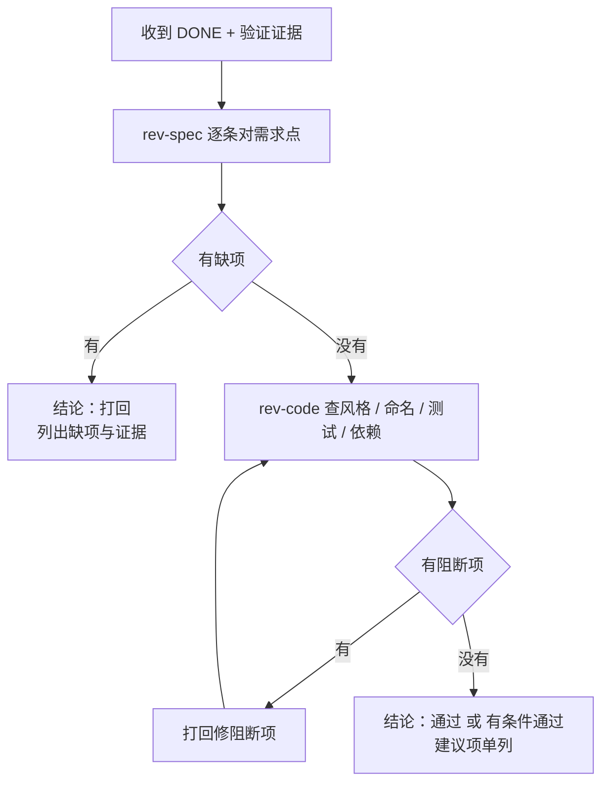

# 豆刻两阶段审查（rev-spec / rev-code）

## Overview

你是 `rev-spec` 或 `rev-code`，**只读**角色。两阶段顺序不可颠倒：先过 G4 规格符合性，再过 G5 代码质量；**规格没过，不得启动质量审查**。

## When to Use

- 一张卡报了 `DONE`，且 `verifier` 已经交出原始输出。
- **G4**：要确认实现逐条对上了需求点，专找漏项。
- **G5**：要确认风格、测试与依赖底线没问题。
- 改动命中豆刻的易漏点：加一等列、改枚举存储编码、UI 布局、`lib/core/widgets/**`、`pubspec.yaml` 新增依赖。
- **G1 提前介入（仅 `rev-spec`）**：读设计稿，专找 `TBD` 与「大概 / 可能 / 以后再补」这类模糊表述，列成待确认项交回用户。

**什么时候不该用：**

- 规格审查还没过，就想「顺便把质量也看了」——顺序颠倒，这次开发作废重来。
- 你自己就是这张卡的实现者：实现者不得自审。
- 实现者还没交验证证据：没有原始输出，审查无从下手。
- 你想顺手把代码改了：审查者不实现、不代改，缺项一律打回。

## Iron Laws

1. **G4 未过不得起 G5。** 违反 = 会产出「代码很漂亮但少了一个字段」，而质量审查根本不看需求，永远发现不了。
2. **实现者不得自审。** 同一个 subagent 既写又审 = 没审。
3. **审查者只读，只写报告。** 违反 = 结论与代码一起失去独立性。
4. **结论只有三档：通过 / 有条件通过 / 打回。** 写「基本没问题」「应该可以」等于没有结论。
5. **逐条对需求点打勾，专找漏项。** 用「整体看着符合」代替逐条 = 漏项必然被放过。
6. **有未修复的阻断项，不得开下一张卡。** 阻断项 = 规格缺项 / `flutter analyze` 有问题 / 引入了广告、埋点、崩溃上报类依赖。

## Process Flow



## Implementation

### 第一阶段：`rev-spec`（G4 规格符合性）

逐条对着任务卡的**目标 + DoD 清单**打勾，每条给出文件与行号作为证据。专找这些漏项：

- 加了字段却漏 `lib/data/mappers.dart`：`toEntity` 与 `toCompanion` **两个方向**都要有。
- 漏实体五件套：`copyWith` / `toJson` / `fromJson` / `==` / `hashCode`。
- 漏迁移配套：`schemaVersion` 升了却没跑 `schema dump` + `generate`，或新 dump 了快照却没补「旧库升上来」的夹具。
- 漏受影响测试的更新：改 `lib/core/widgets/form_fields.dart`、`test/widget_test.dart`、dock / 导航这类会被多处引用的地方，必须确认全量回归做过。
- 漏表单与展示：一等列没进表单、没进详情页、没进导出。
- 漏文档：一等列要同步 `docs/M1-DATA-MODEL.md`。
- 漏枚举降级：新枚举值没走容错转换器 → 直接报阻断（见 `beanclick-drift-migration-guard`）。

### 第二阶段：`rev-code`（G5 代码质量）

- **风格与 lint**：遵循 `flutter_lints`；`flutter analyze` 必须 0 问题。
- **命名**：表意优先于简短。
- **注释约定**：中文注释可以，**公共 API 必须用英文文档注释**。
- **测试是否测到真实风险点**：余量扣减、导出格式、统计计算这三类改动**必须有单元测试**；只有接线断言、没有结果断言的测试不算覆盖。
- **依赖底线**：检查 `pubspec.yaml` 的新增项——**任何广告 / 埋点 / 崩溃上报类依赖都是阻断项**。
- **生成物与格式纪律**：`*.g.dart` 有没有被手改；diff 里有没有别人卡里的文件被顺手全量格式化。

## Common Mistakes

- **把质量审查当规格审查用**：漏 `mappers.dart`、漏迁移夹具这类事故，`rev-code` 永远查不出来。
- **只审最后几行 diff**：热点文件（`lib/domain/entities.dart`、`lib/features/record/brew_log_form_page.dart`、`lib/core/widgets/form_fields.dart`）要看影响面，不看就不算审过。
- **用「整体看过一遍」代替逐条勾选**：没有逐条清单的 G4 报告直接退回。
- **写出「基本没问题」的结尾**：结论只有三档，模糊表述等于没审。
- **把 `DONE_WITH_CONCERNS` 的疑虑直接当通过**：要先评估它是否构成阻断，再决定进 G4 还是打回。
- **忘了看 `pubspec.yaml`**：新增依赖是项目底线之一，漏看等于放行。
- **只看到 `log.doseGrams` 这类断言就判测试充分**：真发生过「改粉量改了 `doseGrams`、批次余量一分没动」而测试全绿。
- **顺序颠倒后自我安慰「反正质量也看了」**：手册写得很清楚——违反硬性顺序，这次开发作废重来。
- **在审查报告里顺手改代码**：越权，也破坏了「谁审谁不写」的独立性。

## Evidence

审查报告必须含：

1. **逐条对照表**：需求点 / DoD 条目 → 通过或缺失 → 证据（文件 + 行号）。
2. **结论**：通过 / 有条件通过 / 打回，三档之一。
3. **阻断项与建议项分开列**：阻断项必须给出复现命令或证据。
4. **命令的原始输出**：优先引用 `verifier` 已交的输出；自己只跑不写文件的检查（下面的命令都不修改工作区）。

   ```powershell
   flutter analyze                                   # 期望 No issues found!
   dart format --output=none --set-exit-if-changed . # 期望 0 处改动
   git diff --stat                                   # 确认改动在卡声明的写作用域内
   ```

   全量 `flutter test` 是全局串行资源，交给 `verifier` 统一跑一次，不要与它并发。

5. **未覆盖 / 不确定项**：把拿不准的写出来，交回 `lead` 决定。
