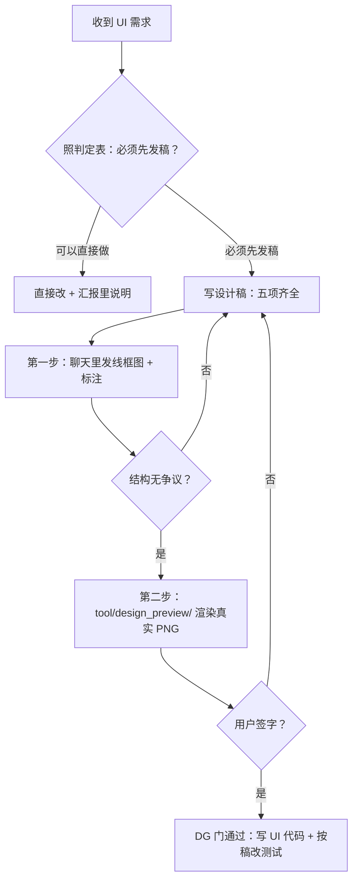

# 豆刻 UI 设计稿门（DG 门）

## Overview

任何 UI 改动都先出设计稿、拿到**用户的签字**，才能写 UI 代码。
DG 门的出口条件只有一个：用户明确点头（[`DEVELOPMENT.md`](../../../DEVELOPMENT.md) §13.1）。

## When to Use

- 收到「把 A 挪到 B」「加个按钮」「右滑改左滑」这类含混的 UI 描述 —— 先弄清词义再发稿。
- 要新增 / 删除控件、新的页面或弹层、改导航结构与 dock / 标题栏组成。
- 要新增状态或空态、改变既有空态含意、改交互行为（手势 / 长按 / 滑动 / 双击）。
- 预估会让现有 widget 测试断言失效的改动（例如 `test/widget_test.dart` 的外壳冒烟）。

**什么时候不该用**

- 纯文案措辞与错别字、等价图标替换、不改结构的颜色 / 间距微调、不触碰测试断言的内部整理 ——
  直接做，做完在汇报里说明即可。
- 只读探索、只写文档、只改 `lib/data/**`（那是 MG 门的地盘，不是 DG 门）。
- 用户已经在设计稿上签过字、且本次改动**没有越出那份稿** —— 按已定稿执行，不必重走一遍。

## Iron Laws

1. **没有用户签字，不许动 UI 代码。** 后果：做完才发现理解错了「收藏」「右滑」指的是什么，返工成本高得多。
2. **线框图没定住结构，不许去渲染 PNG。** 后果：结构每改一次都要重渲染，观感讨论淹没结构讨论。
3. **渲染脚手架只放 `tool/design_preview/`，绝不放 `test/`。** 后果：CI 把它当 golden 比对，跨平台字体差异造成假红。
4. **设计稿必须点名「受影响的测试」。** 后果：实现完 `flutter test` 红一片，才发现改动面比想的大。
5. **待确认项不许自己拍板。** 后果：用户没机会说「不」，最后照代理的理解做完了。
6. **`impl-ui` 不得绕过 DG 报 `DONE`。** 设计稿没定就是 `BLOCKED`，不是 `DONE_WITH_CONCERNS`（手册 §8.1）。

### 判定表（照 §13.1）

| 直接做，做完在汇报里说明 | **必须先发稿等确认** |
|---|---|
| 纯文案措辞、错别字 | 布局结构调整（增删栏位、换位置、改层级） |
| 图标替换成等价图标 | 交互行为（手势、长按、滑动、双击） |
| 颜色 / 间距的微调（不改变结构） | 新增或删除控件、新的页面 / 弹层 |
| 不触碰测试断言的内部整理 | 导航结构、dock / 标题栏的组成 |
| | 新增状态或空态、改变既有空态含意 |
| | 任何会让现有测试断言失效的改动 |

**拿不准就按「先发稿」处理。**

## Process Flow

## Implementation

1. **澄清词义**：把需求里每个含混词翻成可判定的句子，写进设计稿的「目标」。
2. **写设计稿**，必含五项，一项不能少：

   | 项 | 要求 |
   |---|---|
   | 目标 | 这次要解决什么、用户原话是什么 |
   | 布局示意 | ASCII 线框图，标出各元素位置与相对关系 |
   | 尺寸与状态 | 关键尺寸（高度 / 圆角 / 图标大小）；空态、有数据、滑开、长按等状态 |
   | 与现状的差异 | 删了什么、加了什么、连带变化，**含受影响的测试**（点名文件与用例） |
   | 待确认项 | 2–3 个拿不准的点，列成选项让用户挑 |

3. **第一步：聊天里的线框图 + 标注**。只谈结构 / 层级 / 文案 / 状态，来回改到结构无争议为止。
4. **第二步：真实渲染的 PNG**。结构定稿后，用真主题（`buildAppTheme`）+ 中文字体 + Material
   图标字体把这一屏渲染成图，给用户看配色、字重、间距；他点头才算定稿。
5. **渲染规矩**（每条都对应一次真实踩坑）：
   - 跑法：`flutter test tool/design_preview/<xxx>_test.dart --update-goldens`，单独跑。
   - **不许放 `test/`**：CI 当 golden 比对，跨平台字体差异会造成假红。
   - 渲染数据要同时覆盖**空态与有数据两条路径**，别只画「有数据」那版。
   - **被 `SingleChildScrollView` 裁掉的内容 golden 永远比不出来**：截图目标必须是内容 Column 的
     key（`previewSheetKey`），并断言它的高度 ≤ 真实视口高；否则加了新段落而图上少一段，测试还全绿。
   - 本机字体路径必须**自动探测 + 环境变量可覆盖**（`BEANCLICK_PREVIEW_CJK_FONT` /
     `BEANCLICK_PREVIEW_ICON_FONT` 这类），**不要写死**。
6. **拿到签字**：定稿后把设计稿落盘为 `docs/M<里程碑>-<主题>设计稿.md`（形如 `M2.10-研磨刻度设计稿.md`），
   汇报里写「DG 门：用户已签字 + 定稿文件路径 + 定稿版号」。**没签字就是没签字**，不许写「已默认确认」。
7. **定稿之后**：改代码 → 按「受影响的测试」清单改 / 补测试 → `flutter analyze` / `dart format` /
   `flutter test` 全绿 → 文档同步 → 交 `verifier` 独立跑命令（见 `beanclick-verify-before-done`）。
   写码这一步按 `beanclick-subagent-task-loop` 的 RED / GREEN / REFACTOR 走。

## Common Mistakes

| 坑 | 后果 | 正确做法 |
|---|---|---|
| 跳过设计稿直接改 UI | 用户明确要求先出稿；含混词做完再改成本高得多 | 过 DG 门，签字后再写码 |
| 设计稿只写「大概这样」 | 用户没法给出有效反馈，签字等于没签 | 五项齐全，尺寸与状态写具体值 |
| 把渲染脚手架放进 `test/` | CI 当 golden 比对，字体差异造成假红 | 放 `tool/design_preview/`，单独跑 |
| 只渲染「有数据」一版 | 空态没人审，上线才发现空态难看 | 空态 / 有数据两条路径都渲染 |
| 截图目标是整个 `Scaffold` | 被 `SingleChildScrollView` 裁掉的内容静默消失，图少一段无人发现 | 截内容 Column 的 key，并断言不超视口 |
| 写死本机字体路径 | 换台机器渲染不出中文；公开仓库里还属「必须外置」 | 自动探测 + `BEANCLICK_PREVIEW_*` 环境变量覆盖 |
| 拿不准却按「可以直接做」处理 | 结构改完了才被用户否掉 | 拿不准一律先发稿 |
| 稿子定了但测试清单没写 | 实现者改完功能代码，回归网还是红的 | 「与现状的差异」里点名受影响的测试文件与用例 |

## Evidence

交给 `lead` / `verifier` 时必须附：

- 设计稿文件路径 + 定稿版号（例如「第 3 稿」），以及**用户签字的原话**。
- 渲染 PNG 的路径 + 生成命令 + 退出码（`--update-goldens` 的那次运行）。
- 确认「空态 / 有数据」两条路径都渲染过，且内容是截内容 key 而非整屏。
- 「与现状的差异」里点名的**受影响测试清单**：文件 + 用例 + 打算怎么改。
- 若走「直接做」通道：逐条说明它为什么落在判定表左列。
